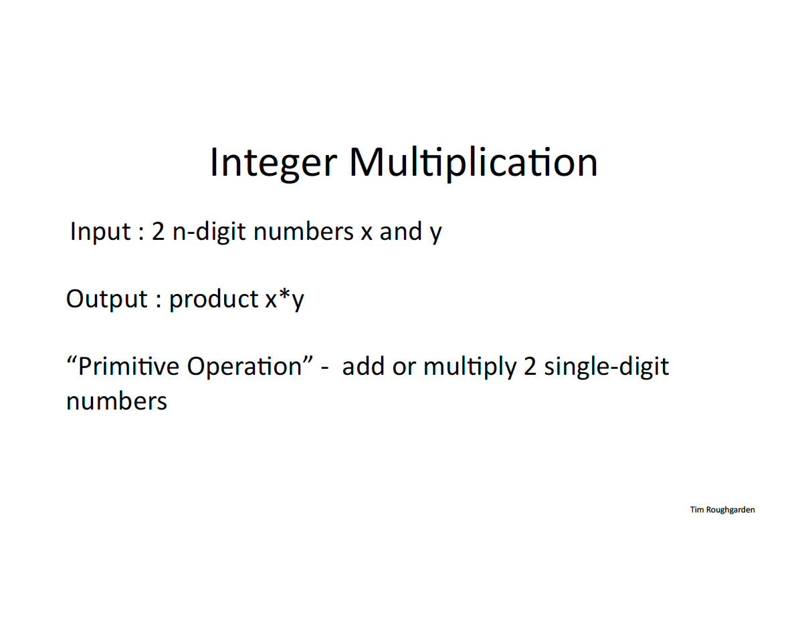
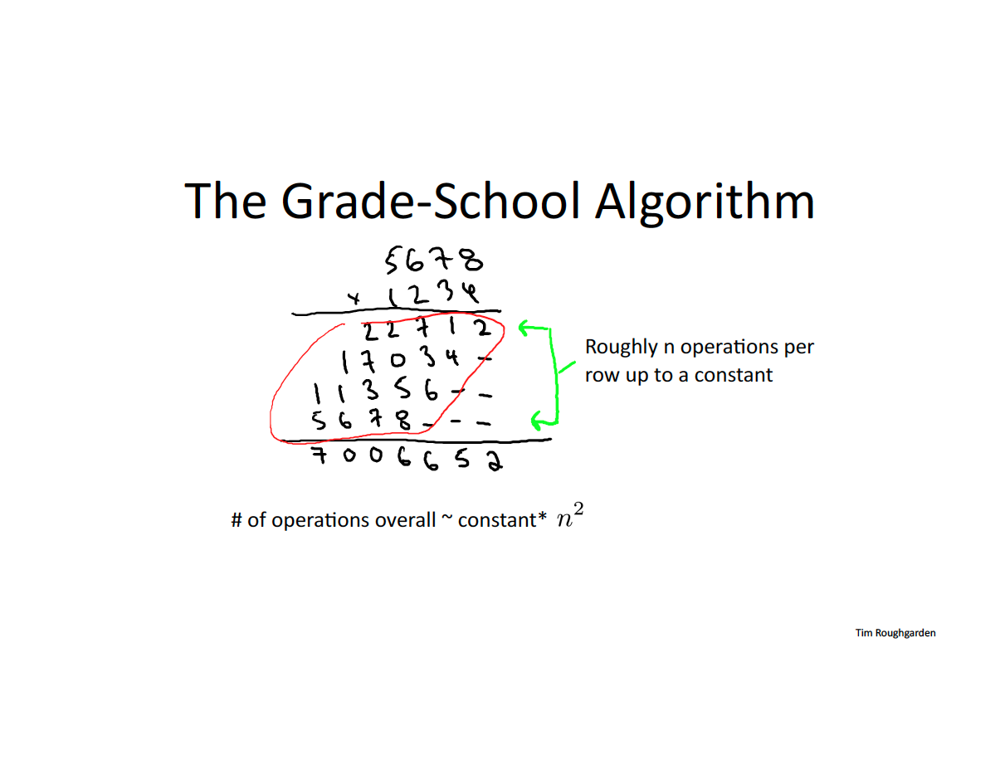
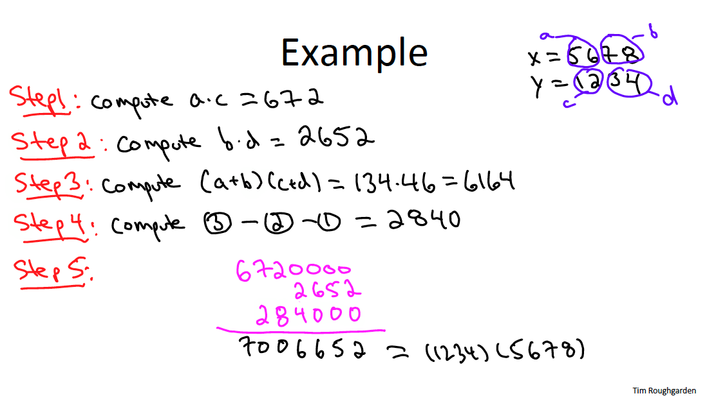
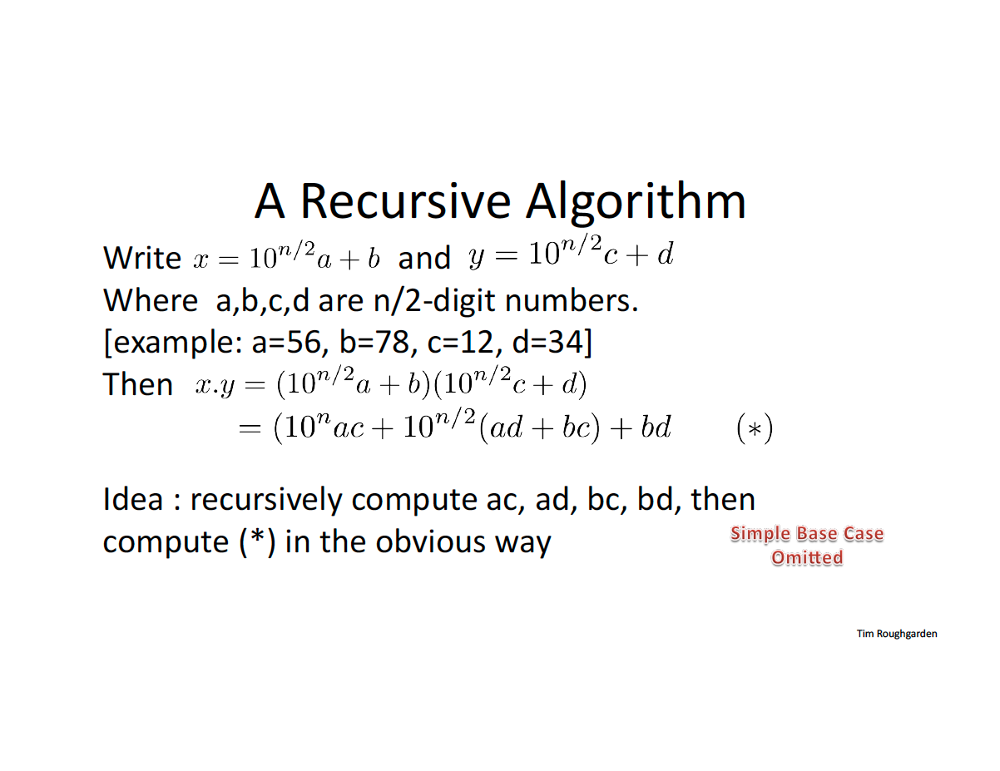
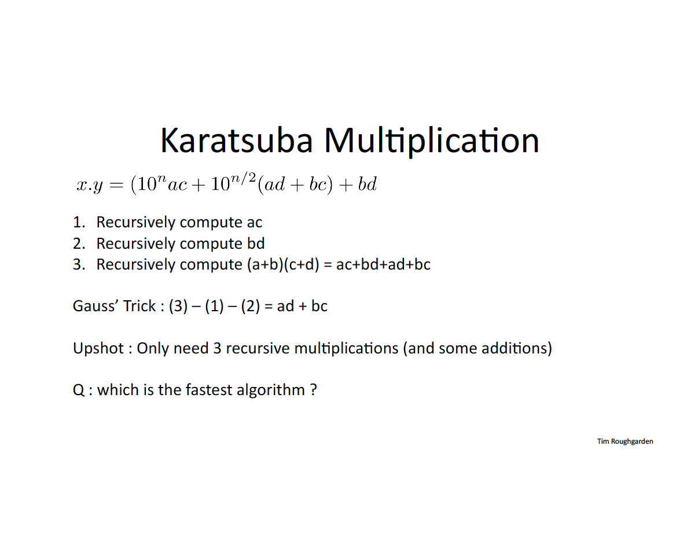

# Karatsuba Multiplication ( trivial templates )
[https://en.wikipedia.org/wiki/Karatsuba_algorithm](https://en.wikipedia.org/wiki/Karatsuba_algorithm)

## Contents
* [Lecture](#lecture)
* [Lecture Slides](#lecture-slides)
* [C++ Solution](#cpp-solution)
* [Build Instructions](#build-instructions)
* [Dependencies](#dependencies)
* [Python Solution](#python-solution)

## Lecture
[Video](https://www.coursera.org/lecture/algorithms-divide-conquer/karatsuba-multiplication-wKEYL)

## Lecture Slides

---

---

---

---

---

---

---

---

## CPP Solution
```cpp

    /**
     *
     * Modern C++ implementation of Karatsuba algorithm to perform multiplication of two integers 
     *
     * (c) Copyright 2019 Clayton J. Wong ( http://www.claytonjwong.com )
     *
     **/
     
    
    #include <iostream>
    
    
    using namespace std;
    
    
    template< typename Type >
    class Solution
    {
    public:
    
        Type multiply( Type x, Type y )
        {
            return go( x,y );
        }
    
    private:
    
        Type pow( Type N ){ return( N == 0 )? 1 : 10 * pow( N - 1); }
        Type log( Type N ){ return( N == 0 )? 0 : 1 + log( N / 10); }
    
        Type go( Type x, Type y )
        {
            if( x < 10 || y < 10 ) return x * y;
            auto i{ log(x) }, j{ log(y) }, N{ min(i,j) }, p{ pow(N/2) }, // (p)ivot
                a{ x / p }, b{ x % p },
                c{ y / p }, d{ y % p },
                u{ go(a,c) }, v{ go(a+b,c+d) }, w{ go(b,d) };
            return( u * pow( N )  +  ( v -u -w ) * pow( N/2 )  +  w );
        }
    
    };
    
    
    int main()
    {
        Solution< int > s;
        cout << s.multiply( 3, 7 ) << endl;
        cout << s.multiply( 20, 20 ) << endl;
        cout << s.multiply( 1234, 5678 ) << endl;
        cout << s.multiply( -11, 11 ) << endl;
        cout << s.multiply( -69, -31 ) << endl;
    
    //    21
    //    400
    //    7006652
    //    -121
    //    2139
    
        return 0;
    }

```

## Build Instructions
Use ```cmake``` to build this project:

```
    cmake --build cmake-build-debug --target karatsuba_multiplication -- -j 4
```

## Dependencies
* [cmake.org](https://cmake.org)

## Python Solution

```python

    ##
    #
    # Python implementation of Karatsuba algorithm to perform multiplication of two integers 
    # 
    # (c) Copyright 2019 Clayton J. Wong ( http://www.claytonjwong.com )
    #
    ##
    
    def pow10( N ):
        if N == 0:
            return 1
        return 10 * pow10( N-1 )
    
    def log10( N ):
        if N == 0:
            return 0
        return 1 + log10( N/10 )
    
    def go( x, y ):
        if x < 10 or y < 10:
            return x * y
        i = log10( x )     # number of digits in x
        j = log10( y )     # number of digits in y
        N = min( i, j )    # minimum number of digits between x, y
        p = pow10( N/2 )   # pivot position 
        a = x / p          # a is the first half of x
        b = x % p          # b is the second half of x
        c = y / p          # c is the first half of y
        d = y % p          # d is the second half of y
        u = go( a, c )
        v = go( a+b, c+d )
        w = go( b, d )
        return u * pow10( N ) + ( v -u -w ) * pow10( N/2 ) + w
    
    def multiply( x, y ):
        return go( x, y )
    
    if __name__ == '__main__':
        print( multiply( 3, 7 ) )       # 21
        print( multiply( 20, 20 ) )     # 400
        print( multiply( 1234, 5678 ) ) # 7006652
        print( multiply( -11, 11 ) )    # -121
        print( multiply( -69, 31 ) )    # -2139

```
