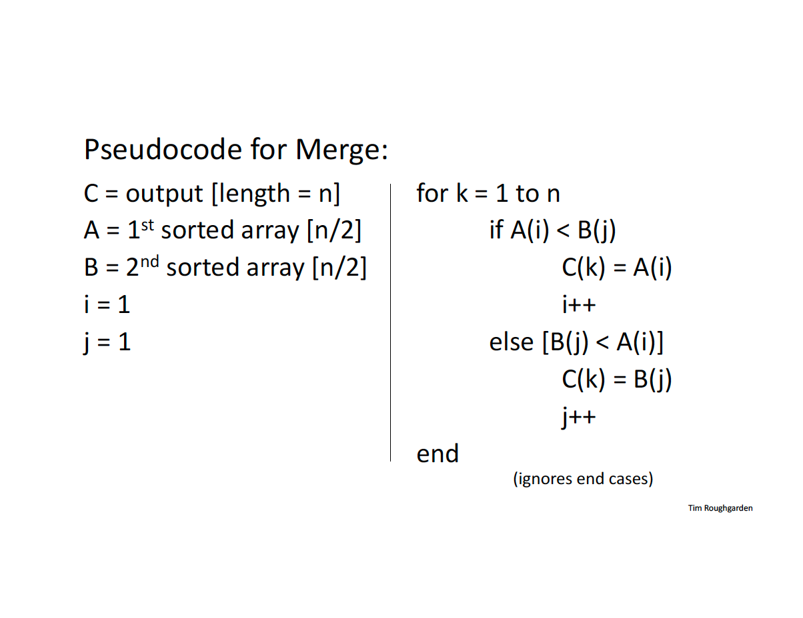
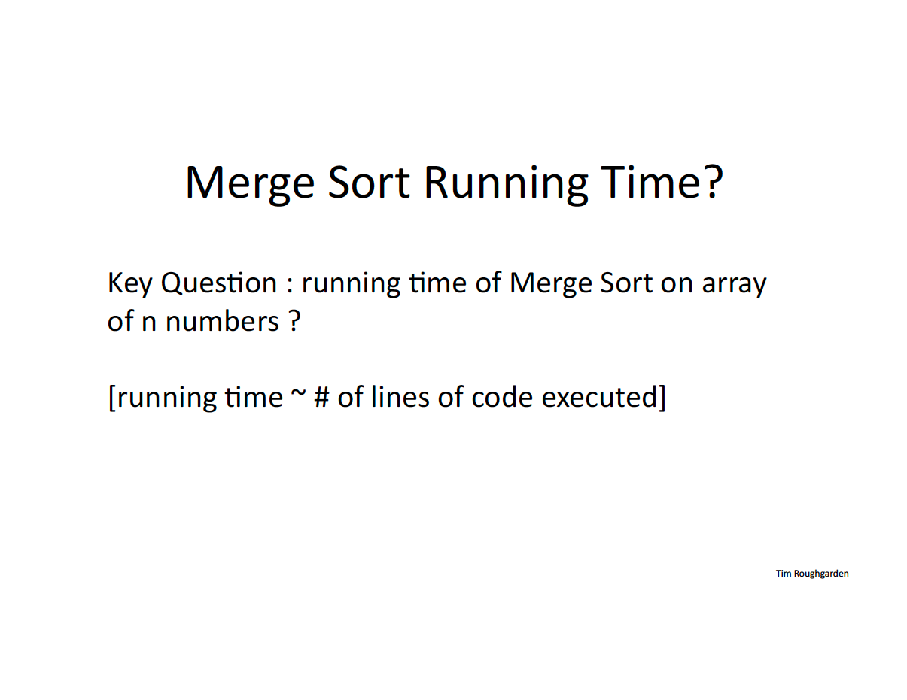
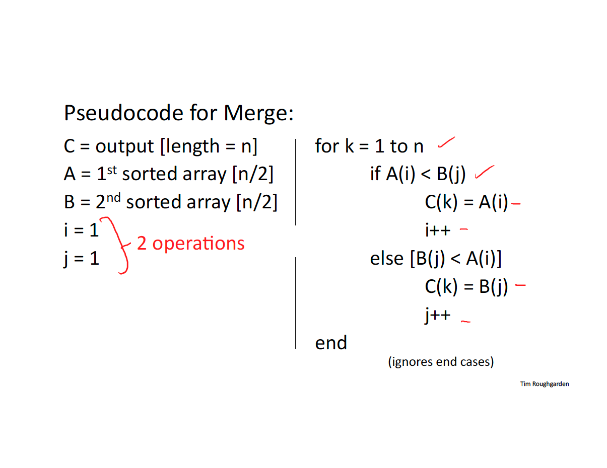
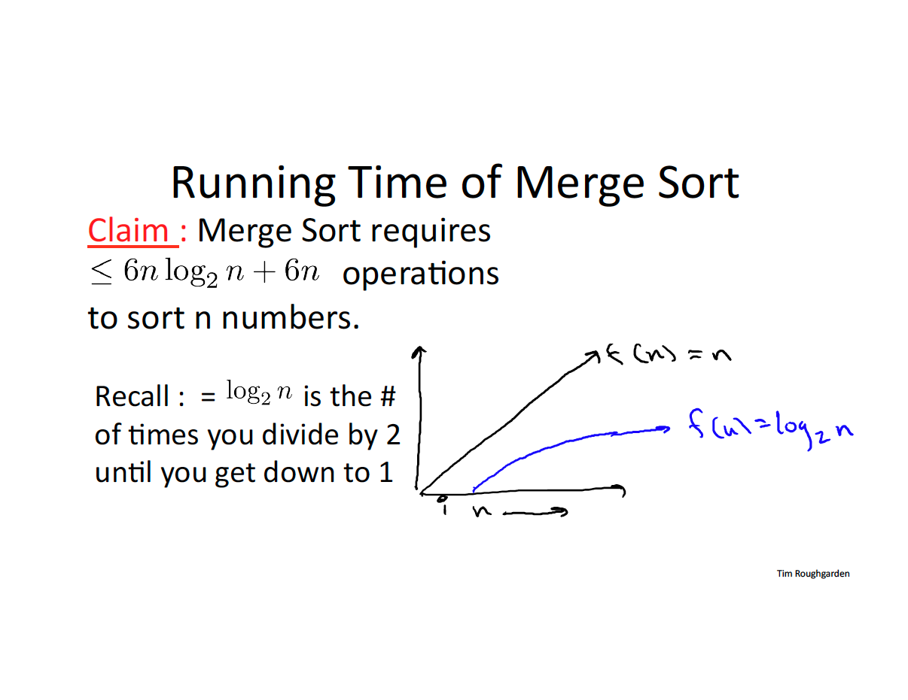
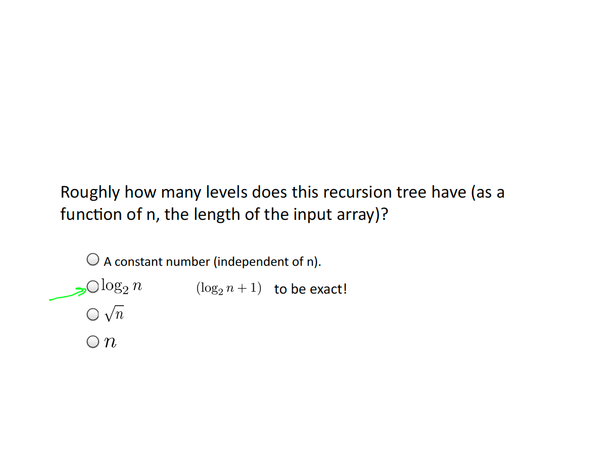
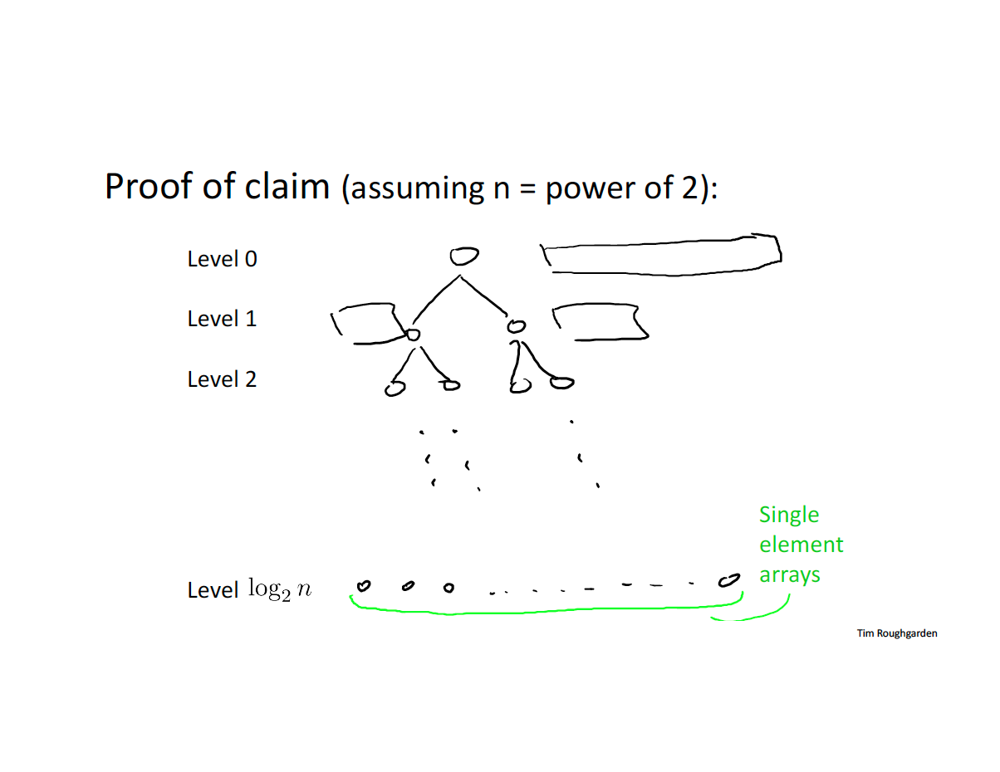
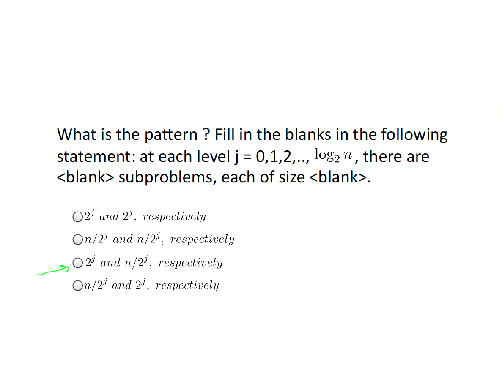
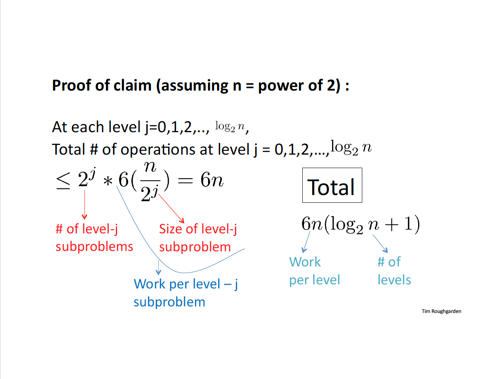

# Merge Sort
[https://en.wikipedia.org/wiki/Merge_sort](https://en.wikipedia.org/wiki/Merge_sort)

## Contents
* [Lecture](#lecture)
* [Lecture Slides](#lecture-slides)
* [C++ Solution](#cpp-solution)
* [Build Instructions](#build-instructions)
* [Dependencies](#dependencies)
* [Python Solution](#python-solution)

# Lecture
* [Video](https://www.coursera.org/lecture/algorithms-divide-conquer/merge-sort-motivation-and-example-4vzQr)

## Lecture Slides

---

---

---

---

---

---

---

---

---

---

---

---

---

---

---

---

---

---

---

## CPP Solution
```cpp
    /**
     *
     * Modern C++ implementation of Merge Sort algorithm to sort a collection
     *
     * (c) Copyright 2019 Clayton J. Wong ( http://www.claytonjwong.com )
     *
     **/
    
    
    #include <iostream>
    #include <vector>
    #include <algorithm>
    
    
    using namespace std;
    
    
    template< typename T >
    class Solution
    {
    public:
    
        using Collection = vector< T >;
    
        Collection mergeSort( const Collection& A )
        {
            return go({ A.begin(), A.end() });
        }
    
    private:
    
        Collection go( Collection&& A )
        {
            if( A.size() < 2 )
                return A;
            auto pivot = A.begin() + A.size() / 2;
            return merge( go({ A.begin(), pivot }), go({ pivot, A.end() }) );
        }
    
        Collection merge( Collection&& lhs, Collection&& rhs, Collection res={} ) // merge (res)ult
        {
            auto L = lhs.begin(), R = rhs.begin();
            while( L != lhs.end() && R != rhs.end() )
                res.push_back( ( *L < *R )? *L++ : *R++ );
            res.insert( res.end(), L, lhs.end() ), res.insert( res.end(), R, rhs.end() ); // append left-overs ( if applicable )
            return res;
        }
    
    };
    
    
    int main()
    {
        using Type = int;
    
        const Solution< Type >::Collection
            A_unsorted{ 9,5,6,3,2,8,0,4,1,7 },
            B_unsorted{ 3,9,7,1,2,8,6,5,0,4 },
            C_unsorted{ 3,2,9,7,1,3,7,2,8,1,6,5,0,8,0,4 };
    
        Solution< Type > s;
        auto
            A{ s.mergeSort( A_unsorted ) },
            B{ s.mergeSort( B_unsorted ) },
            C{ s.mergeSort( C_unsorted ) };
    
        assert( is_sorted( A.begin(), A.end() ) );
        assert( is_sorted( B.begin(), B.end() ) );
        assert( is_sorted( C.begin(), C.end() ) );
    
        cout << "A: "; copy( A.begin(), A.end(), ostream_iterator< Type >( cout, " " ) ); cout << endl;
        cout << "B: "; copy( B.begin(), B.end(), ostream_iterator< Type >( cout, " " ) ); cout << endl;
        cout << "C: "; copy( C.begin(), C.end(), ostream_iterator< Type >( cout, " " ) ); cout << endl;
    
    //    A: 0 1 2 3 4 5 6 7 8 9
    //    B: 0 1 2 3 4 5 6 7 8 9
    //    C: 0 0 1 1 2 2 3 3 4 5 6 7 7 8 8 9
    
        return 0;
    }
```

## Build Instructions
Use ```cmake``` to build this project:

```
    cmake --build cmake-build-debug --target merge_sort -- -j 4
```

## Dependencies
* [cmake.org](https://cmake.org)

## Python Solution
```python
    ##
    #
    # Python implementation of Merge Sort algorithm
    # 
    # (c) Copyright 2019 Clayton J. Wong ( http://www.claytonjwong.com )
    #
    ##
    
    def merge_sort( A ):
        return go( A )
    
    def go( A ):
        if len( A ) < 2:
            return A
        P = len( A ) // 2
        return merge( go( A[ :P ] ), go( A[ P: ] ) )
    
    def merge( L, R ):
        A = []
        i = 0
        j = 0
        while i < len( L ) and j < len( R ):
            if L[ i ] < R[ j ]:
                A.append( L[ i ] )
                i += 1
            else:
                A.append( R[ j ] )
                j += 1
        A.extend( L[ i: ] )
        A.extend( R[ j: ] )
        return A
    
    if __name__ == '__main__':
        A = [ 7, 9, 2, 4, 1, 3, 8, 5, 6, 0 ]
        A = merge_sort( A )
        print( "A: " )
        for x in A:
            print( x )
```
