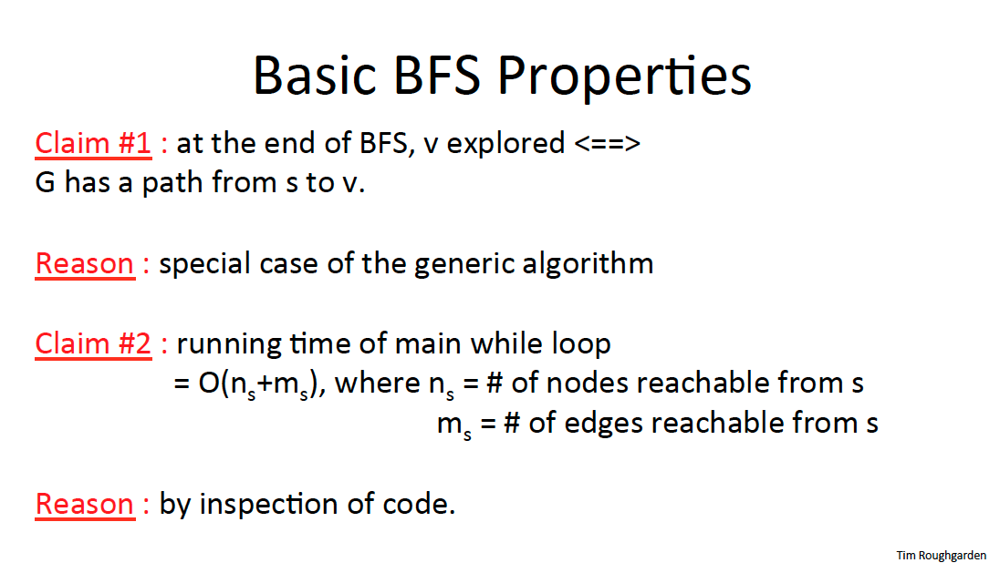
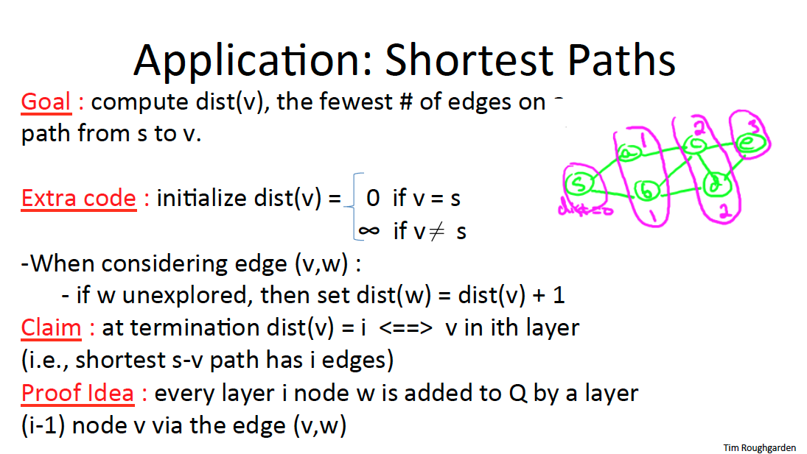
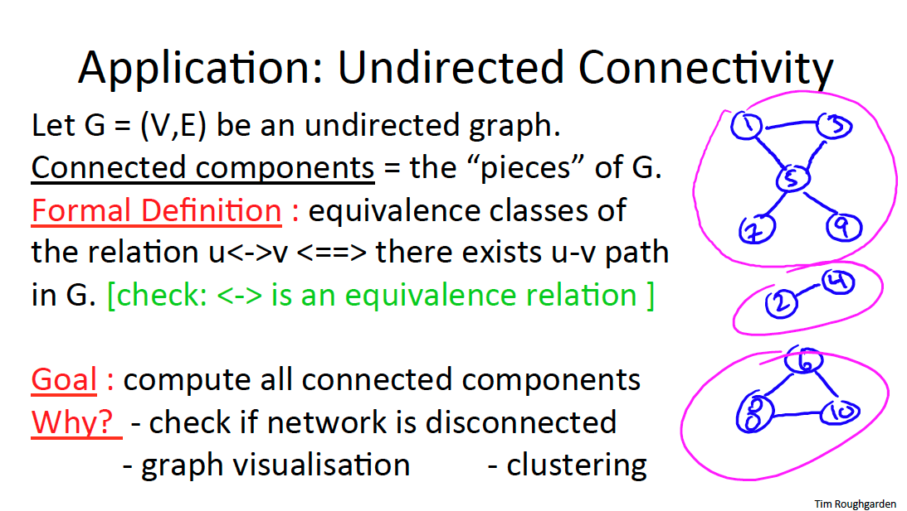
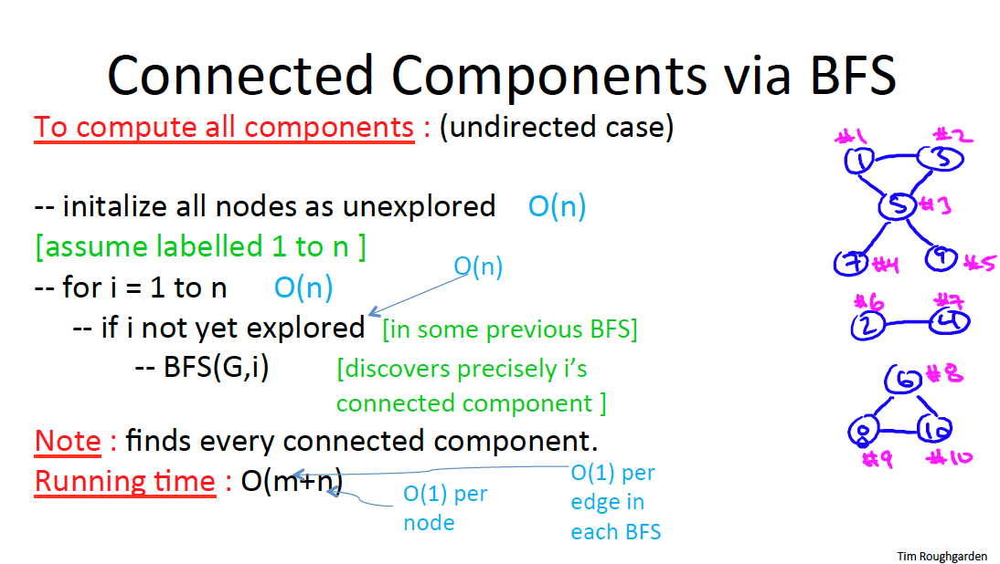

# Minimum Path Distances ( BFS )
[https://en.wikipedia.org/wiki/Breadth-first_search](https://en.wikipedia.org/wiki/Breadth-first_search)

## Contents
* [Lecture Slides](#lecture-slides)
* [Solution](#solution)
* [Build Instructions](#build-instructions)
* [Dependencies](#dependencies)

## Lecture Slides

---

---

---

---

---

---

---


## Solution
```cpp

    /**
     *
     * Modern C++ implementation of Breadth First Search algorithm to find the single-source minimum path distances
     *
     * (c) Copyright 2019 Clayton J. Wong ( http://www.claytonjwong.com )
     *
     **/
    
    
    #include <iostream>
    #include <vector>
    #include <unordered_map>
    #include <unordered_set>
    #include <map>
    #include <queue>
    #include <limits>
    
    
    using namespace std;
    
    
    class Solution
    {
    public:
    
        using Vertex = unsigned char;
        using AdjacencyList = vector< Vertex >;
        using Graph = unordered_map< Vertex, AdjacencyList >;
        using Seen = unordered_set< Vertex >;
        using Queue = queue< Vertex >;
        using Distance = map< Vertex, size_t >;
    
        Distance bfs( Graph& G, Vertex start='s' )
        {
            Distance D{{ start, 0 }};               // augmented-BFS
            Queue q{{ start }};
            Seen seen{ start };
            while( ! q.empty() )
            {
                auto cur{ q.front() }; q.pop();
                for( auto adj: G[ cur ] )
                    if( seen.insert( adj ).second )
                        D[ adj ] = D[ cur ] + 1,    // augmented-BFS
                        q.push( adj );
            }
            return D;
        }
    
    };
    
    ostream& operator<<( ostream& stream, const Solution::Distance& distance )
    {
        for( auto pair: distance )
        {
            stream << "distance to " << pair.first << " = " << pair.second << endl;
        }
        return stream;
    }
    
    int main()
    {
        //
        // Figure 8.5 from page 26 of Algorithms Illuminated ( Part 2 )
        //
        Solution::Graph G = {
    
            { 's', { 'a', 'b' } },
    
            { 'a', { 's', 'c' } },
    
            { 'b', { 's', 'c' } },
    
            { 'c', { 'a', 'b', 'd', 'e' } },
    
            { 'd', { 'b', 'c', 'e' } },
    
            { 'e', { 'c', 'd', } }
    
        };
        Solution solution;
        auto s = solution.bfs( G, 's' );
        auto a = solution.bfs( G, 'a' );
        auto b = solution.bfs( G, 'b' );
        auto c = solution.bfs( G, 'c' );
        auto d = solution.bfs( G, 'd' );
        auto e = solution.bfs( G, 'e' );
        cout << "starting from 's': " << endl << s << endl << endl;
        cout << "starting from 'a': " << endl << a << endl << endl;
        cout << "starting from 'b': " << endl << b << endl << endl;
        cout << "starting from 'c': " << endl << c << endl << endl;
        cout << "starting from 'd': " << endl << d << endl << endl;
        cout << "starting from 'e': " << endl << e << endl << endl;
    
        return 0;
    }

```

## Build Instructions
Use ```cmake``` to build this project:

```
    cmake --build cmake-build-debug --target bfs_min_path_dist -- -j 4
```

## Dependencies
* [cmake.org](https://cmake.org)
