# Dijkstra ( priority queue )
[https://en.wikipedia.org/wiki/Dijkstra%27s_algorithm](https://en.wikipedia.org/wiki/Dijkstra%27s_algorithm)

## Contents
* [Lecture](#lecture)
* [Lecture Slides](#lecture-slides)
* [Solution](#solution)
* [Build Instructions](#build-instructions)
* [Dependencies](#dependencies)

# Lecture
* [Video](https://www.coursera.org/lecture/algorithms-graphs-data-structures/dijkstras-shortest-path-algorithm-rxrPa)

## Lecture Slides

---
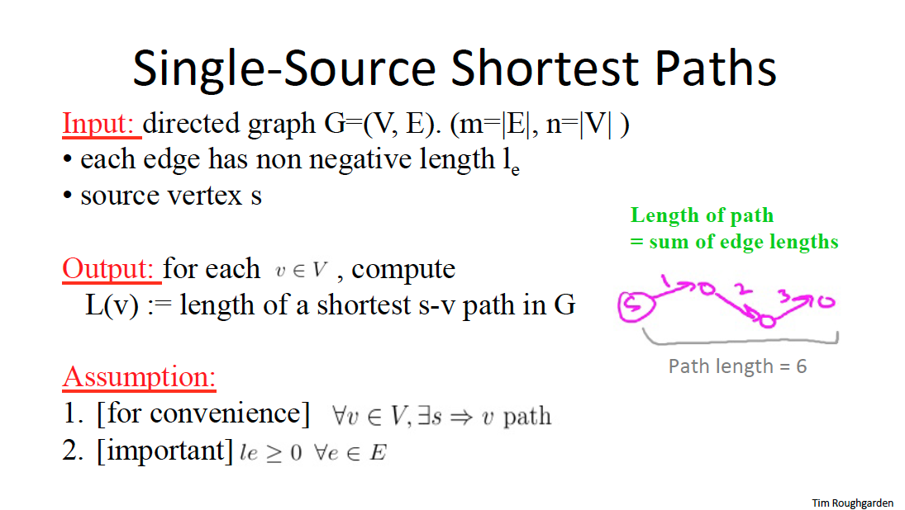
---

---
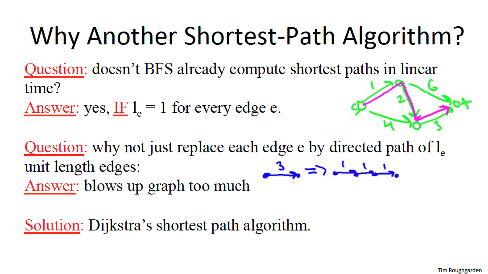
---
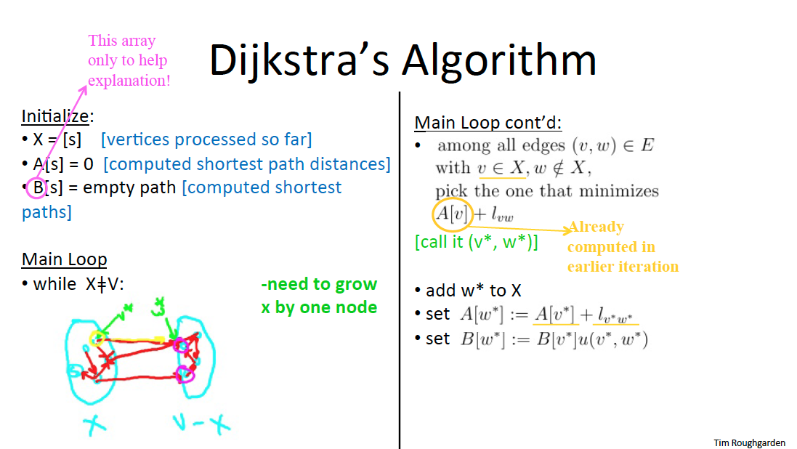
---
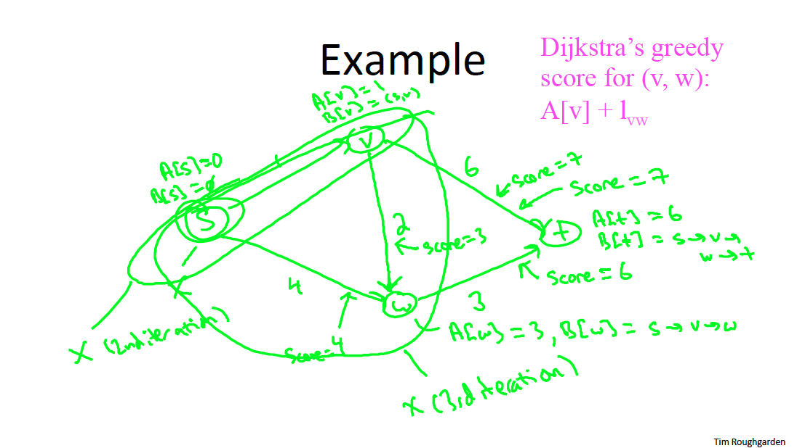
---
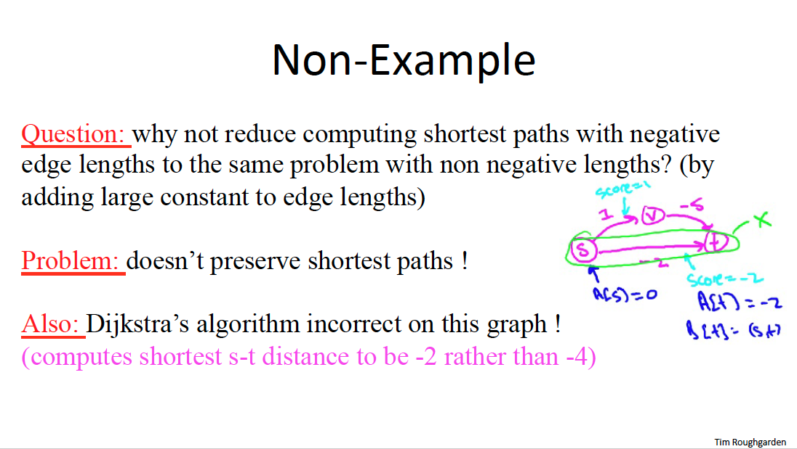
---
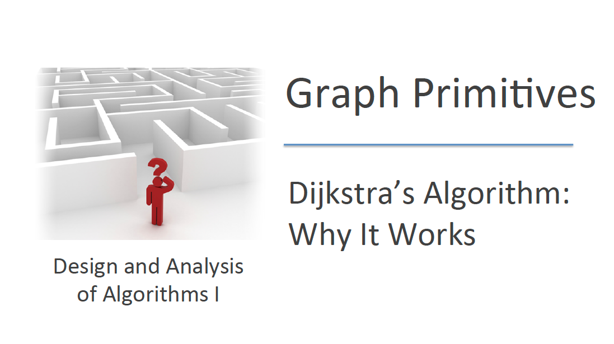
---

---
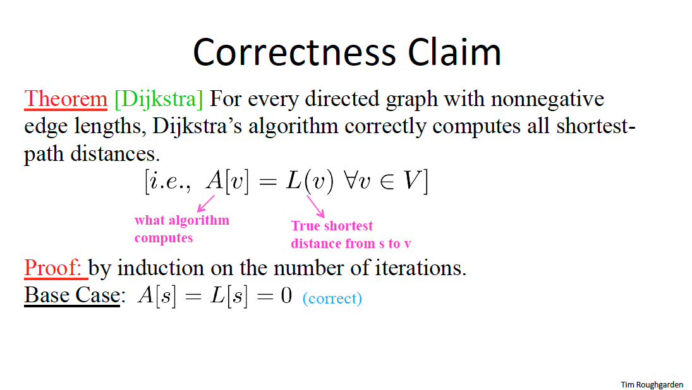
---

---
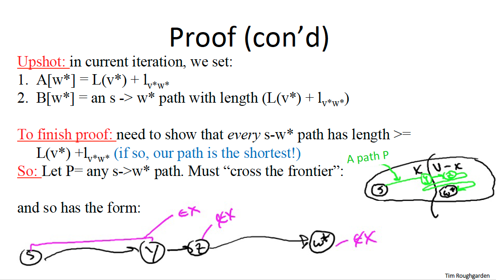
---

---
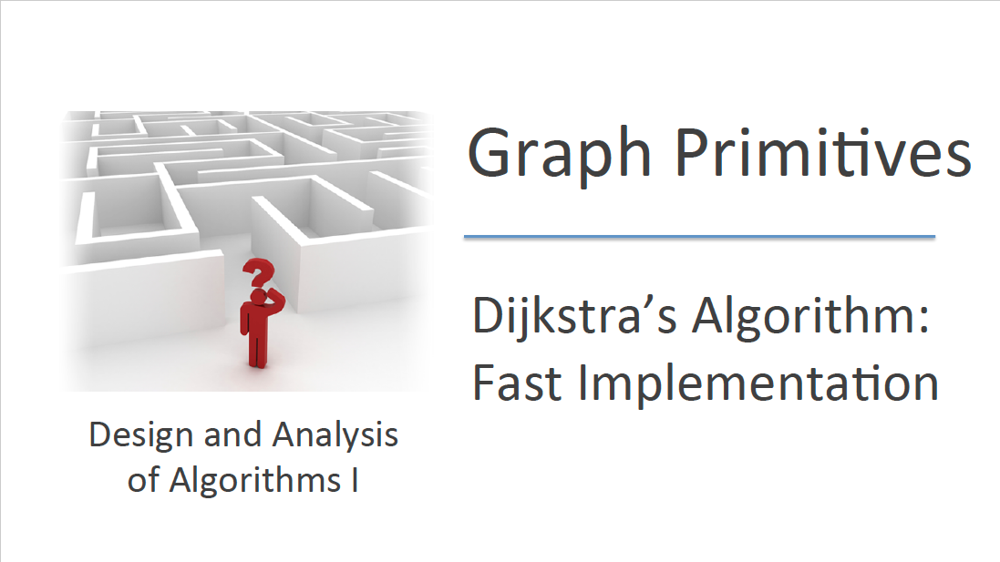
---

---

---
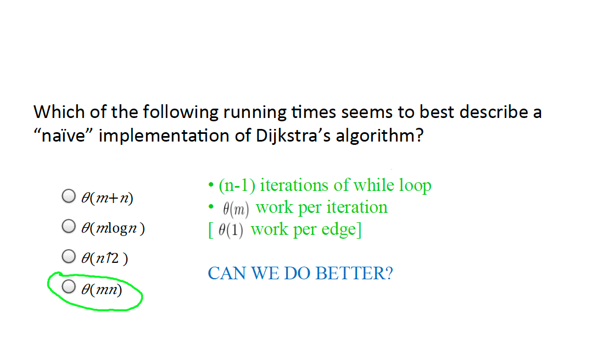
---
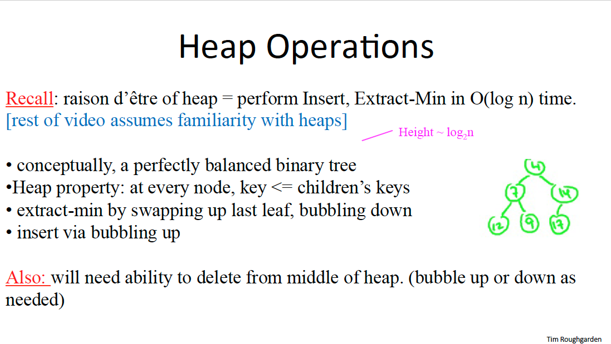
---
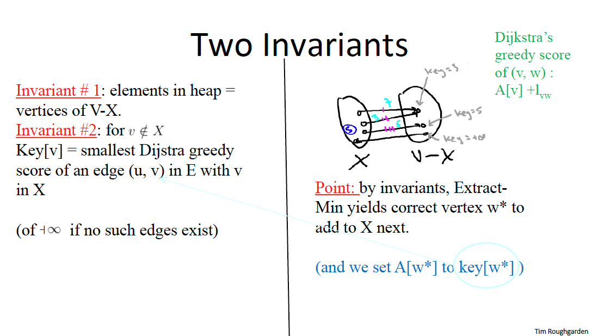
---
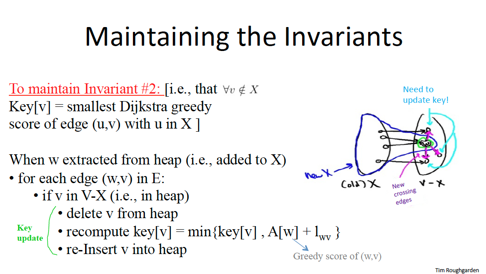
---

---

## Solution
```cpp

    /**
     *
     * Modern C++ implementation of Dijkstra algorithm to find the single-source shortest paths in a graph
     *
     * (c) Copyright 2019 Clayton J. Wong ( http://www.claytonjwong.com )
     *
     **/
    
    
    #include "input.hpp"
    #include <iostream>
    #include <unordered_map>
    #include <unordered_set>
    #include <queue>
    #include <sstream>
    
    
    using namespace std;
    
    
    class Solution
    {
    public:
    
        using Vertex = unsigned int;
        using Cost = size_t;
        static const size_t N{ 200 };
        static const size_t Infinity = numeric_limits< Cost >::max();
        using VertexCost = pair< Vertex, Cost >;
        struct Edge
        {
            Vertex tail{ 0 }, head{ 0 };
            bool operator==( const Edge& rhs ) const { return tail == rhs.tail && head == rhs.head; }
        };
        struct Hash{ Cost operator()( const Edge& e ) const { return ( N+1 ) * e.tail + e.head; } };
        using Edges = unordered_map< Edge, Cost, Hash >;
        using Vertices = unordered_set< Vertex >;
        using MinCost = unordered_map< Vertex, Cost >;
        using AdjacencyList = unordered_set< Vertex >;
        using Graph = unordered_map< Vertex, AdjacencyList >;
        struct Compare{ bool operator()( const VertexCost& lhs, const VertexCost& rhs ) const { return lhs.second > rhs.second; } };
        using Queue = priority_queue< VertexCost, vector< VertexCost >, Compare >;
        using Parent = unordered_map< Vertex, Vertex >;
    
        Graph generateGraph( const Vertices& V, const Edges& E, Graph G={} )
        {
            for( auto& vertex: V )
                G[ vertex ] = {};
            for( auto& pair: E )
            {
                auto edge{ pair.first };
                G[ edge.tail ].insert( edge.head );
            }
            return G;
        }
    
        pair< MinCost, Parent > getShortestPaths( Graph& G, Edges& E, Vertex start, Queue q={}, MinCost C={}, Parent P={} )
        {
            for( auto& pair: G )
            {
                auto vertex{ pair.first };
                C[ vertex ] = Infinity;
            }
            C[ start ] = 0;
            for( q.push({ start, C[ start ] }); ! q.empty(); q.pop() )
            {
                auto tail{ q.top().first };
                auto cost{ q.top().second };
                for( auto& head: G[ tail ] )
                {
                    Edge edge{ tail, head };
                    auto candidate = cost + E[ edge ];
                    if( C[ head ] > candidate )
                        C[ head ] = candidate,
                        P[ head ] = tail,
                        q.push({ head, C[ head ] });
                }
            }
            return { C, P };
        }
    
        Edges readInput( const string& input, Edges edges={}, Vertex tail=0, Vertex head=0, char comma=',', Cost cost=0 )
        {
            istringstream stream{ input };
            for( string line; getline( stream, line ); )
            {
                stringstream parser{ line };
                parser >> tail;
                while( parser >> head >> comma >> cost )
                    edges.insert({ { tail, head }, cost });
            }
            return edges;
        }
    
    };
    
    
    int main()
    {
        Solution s;
        Solution::Vertices V;
        for( size_t vertex{ 1 }; vertex <= 200; ++vertex )
            V.insert( vertex );
        auto E = s.readInput( INPUT );
        auto G = s.generateGraph( V, E );
        auto[ C, P ] = s.getShortestPaths( G, E, 1 );
        for( auto vertex: { 7,37,59,82,99,115,133,165,188,197 } )
            cout << C[ vertex ] << ",";
        cout << endl;
    
        return 0;
    }

```

## Build Instructions
Use ```cmake``` to build this project:

```
    cmake --build cmake-build-debug --target dijkstra -- -j 4
```

## Dependencies
* [cmake.org](https://cmake.org)
