# Kosaraju ( DFS + DFS - Iterative )
[https://en.wikipedia.org/wiki/Kosaraju%27s_algorithm](https://en.wikipedia.org/wiki/Kosaraju%27s_algorithm)

## Contents
* [Lecture](#lecture)
* [Lecture Slides](#lecture-slides)
* [Solution](#solution)
* [Build Instructions](#build-instructions)
* [Dependencies](#dependencies)

# Lecture
* [Video](https://www.coursera.org/lecture/algorithms-graphs-data-structures/computing-strong-components-the-algorithm-rng2S)

## Lecture Slides
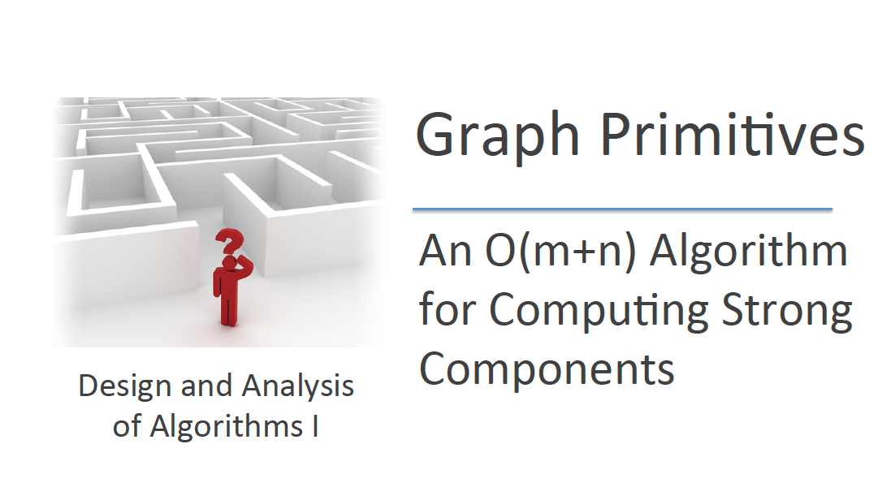
---

---
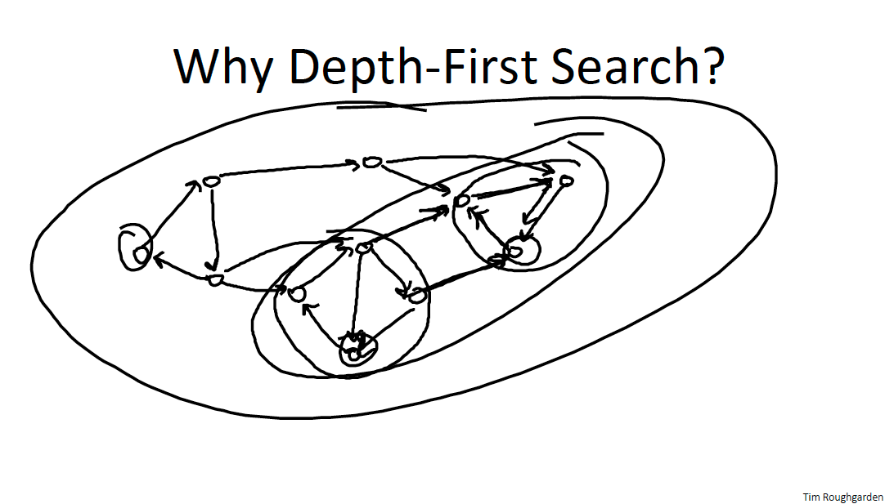
---
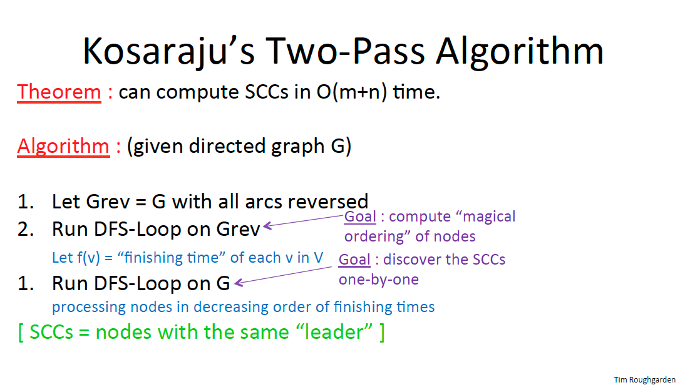
---
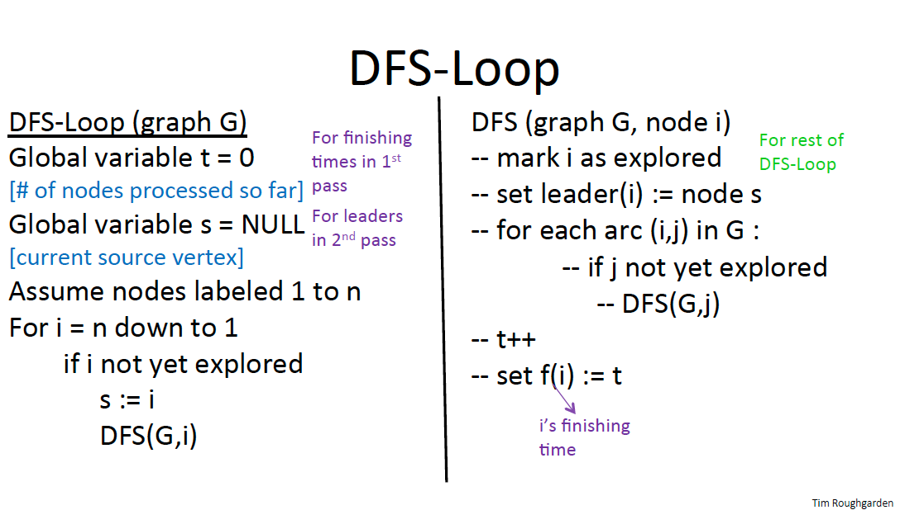
---
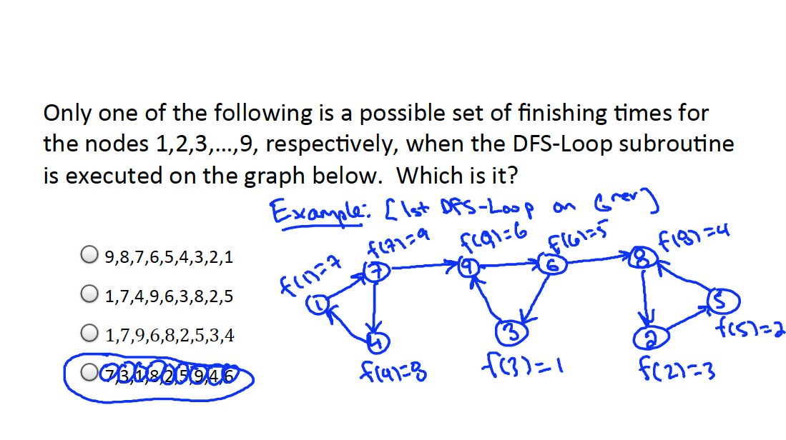
---
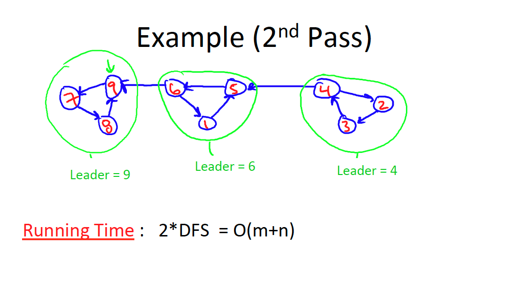
---
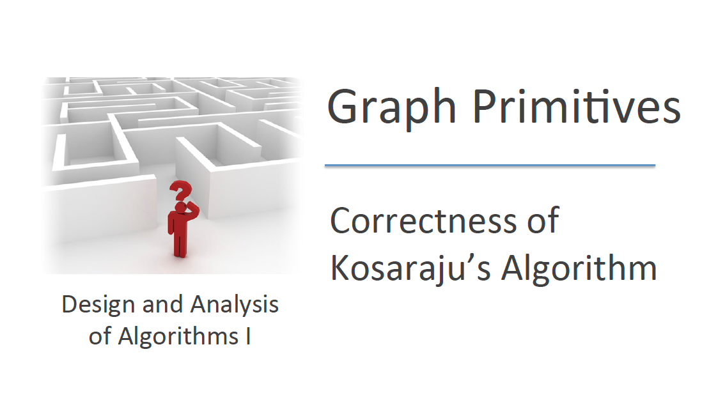
---
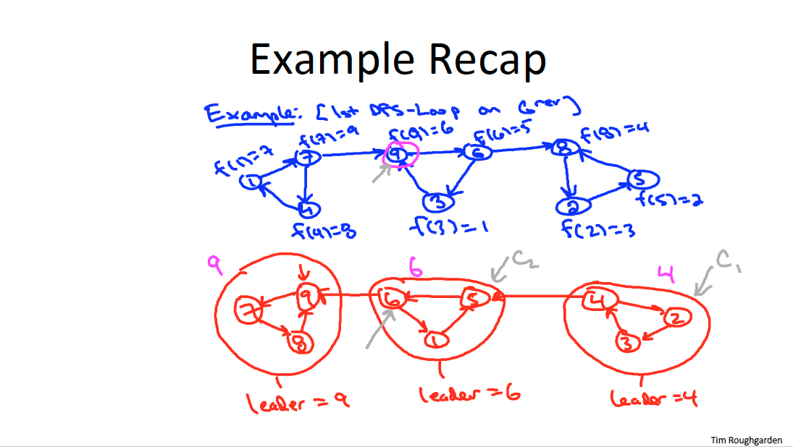
---
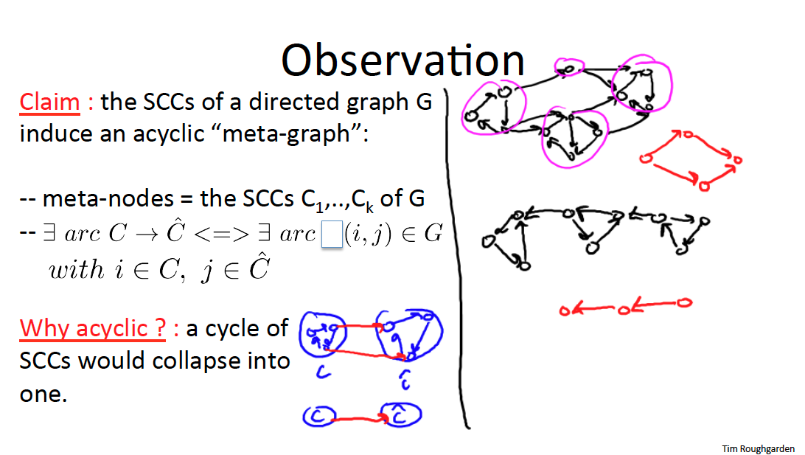
---
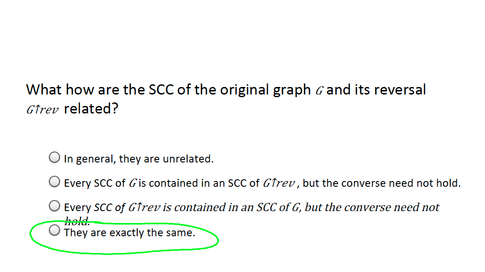
---
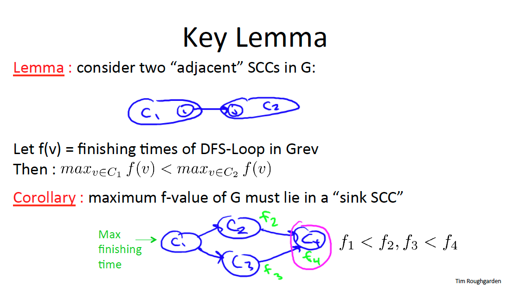
---
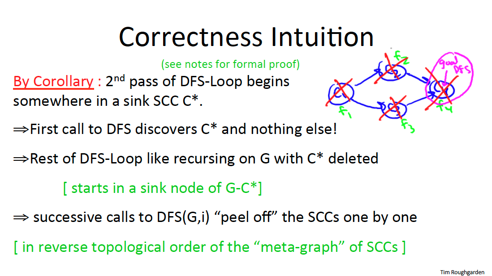
---

---

## Solution
```cpp

    /**
     *
     * Modern C++ implementation of Koraraju's algorithm to find the strongly connected components of a directed graph
     *
     * (c) Copyright 2019 Clayton J. Wong ( http://www.claytonjwong.com )
     *
     **/


    #include "input.hpp"
    #include <iostream>
    #include <unordered_map>
    #include <unordered_set>
    #include <set>
    #include <vector>
    #include <queue>
    #include <sstream>
    #include <fstream>


    //#define UNIT_TESTS 69 // comment this line to execute the large homework assignment instead of small unit tests


    using namespace std;


    class Solution
    {
    public:

        using Vertex = size_t;
        using AdjacencyList = unordered_set< Vertex >;
        using Graph = unordered_map< Vertex, AdjacencyList >;
        using Seen = unordered_set< Vertex >;
        using ConnectedComponents = vector< vector< Vertex > >;
        using OrderedList = deque< Vertex >;
        using Stack = vector< Vertex >;

        ConnectedComponents getSCC( Graph& G, ConnectedComponents CC={}, Stack stack={}, Seen seen={} )
        {
            auto L = topo_sort( reverse( G ) );
            for( auto cur: L )
            {
                if( seen.insert( cur ).second )
                    stack.push_back( cur );         // push unseen (cur)rent vertex onto the stack
                Stack path;
                while( ! stack.empty() )
                {
                    auto start{ stack.back() }; stack.pop_back(); path.push_back( start );
                    for( auto adj: G[ start ] )
                        if( seen.insert( adj ).second )
                            stack.push_back( adj ); // push unseen (adj)acent vertex onto the stack
                }
                if( ! path.empty() )
                    CC.emplace_back( path );
            }
            return CC;
        }

    private:

        Graph reverse( Graph& G )
        {
            Graph R( G ); // (R)eversed (G)raph: keep G's vertex keys ( pair.first ), but clear G's adjacency lists ( pair.second )
            for_each( R.begin(), R.end(), []( auto& pair ){ pair.second={}; });
            for( auto& pair: G )
            {
                auto u{ pair.first };
                for( auto v: G[ u ] )   // u -> v
                    R[ v ].insert( u ); // v -> u
            }
            return R;
        }

        OrderedList topo_sort( Graph&& G, Stack stack={}, Seen seen={} )
        {
            OrderedList L;
            for( auto& pair: G )
            {
                auto cur{ pair.first };
                if( seen.insert( cur ).second )
                    stack.push_back( cur );         // push unseen (cur)rent vertex onto the stack
                Stack path;
                while( ! stack.empty() )
                {
                    auto start{ stack.back() }; stack.pop_back(); path.push_back( start );
                    for( auto adj: G[ start ] )
                        if( seen.insert( adj ).second )
                            stack.push_back( adj ); // push unseen (adj)acent vertex onto the stack
                }
                for(; ! path.empty(); L.push_front( path.back() ), path.pop_back() );
            }
            return L;
        }

    };

    #ifdef UNIT_TESTS
    int main()
    {
        Solution s;
        Solution::Graph G;
        for( auto& test: { TEST_CASE_0, TEST_CASE_1, TEST_CASE_2, TEST_CASE_3, TEST_CASE_4, TEST_CASE_5, TEST_CASE_6, TEST_CASE_7 } )
        {
            G.clear();
            auto u{ 0 }, v{ 0 };
            stringstream input{ test };
            for( string line; getline( input, line ); )
            {
                stringstream parser{ line }; parser >> u >> v;
                G[ u ].insert( v );
            }
            auto CC = s.getSCC( G );
            auto index{ 0 };
            for( auto& C: CC )
            {
                cout << index++ << ": ";
                for( auto& vertex: C )
                    cout << vertex << " ";
                cout << endl;
            }
            cout << endl;
        }

        return 0;
    }
    #else

    string topN( Solution::ConnectedComponents& CC, size_t N=5, ostringstream os=ostringstream() )
    {
        using Largest = set< size_t, greater< int > >;
        Largest S;
        for( auto& C: CC )
            S.insert( C.size() );
        if( N > S.size() )
            N = S.size();
        copy_n( S.begin(), N, ostream_iterator< int >( os, "," ) );
        string result{ os.str() };
        result.pop_back();
        return result;
    }

    int main()
    {
        Solution::Graph G;
        fstream stream{ "input.txt" }; // this file was too big to upload to github, so it is compressed as "input.txt.zip"
        for( string line; getline( stream, line ); )
        {
            stringstream parser{ line };
            auto tail{ 0 }, head{ 0 };
            parser >> tail >> head;
            G[ tail ].insert( head );
        }
        Solution s;
        auto CC = s.getSCC( G );
        auto ans = topN( CC );
        cout << "Answer: " << ans << endl;
        return 0;
    }
    #endif

```

## Build Instructions
Use ```cmake``` to build this project:

```
    cmake --build cmake-build-debug --target kosaraju_itr -- -j 4
```

## Dependencies
* [cmake.org](https://cmake.org)
