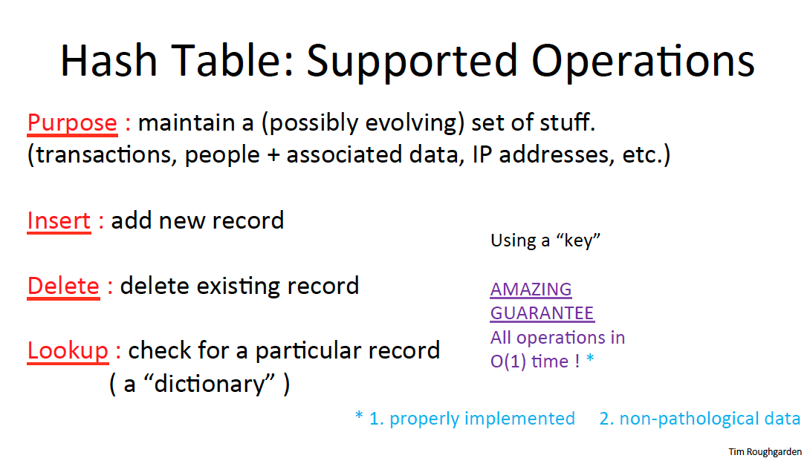
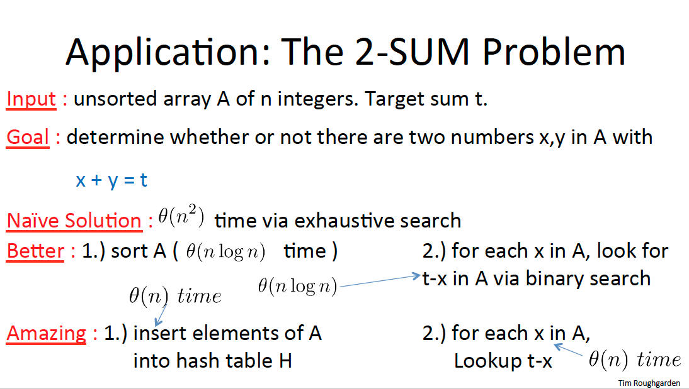
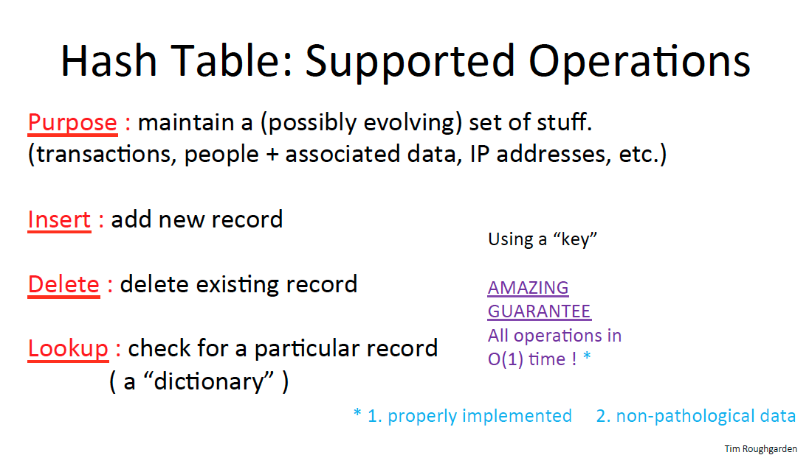
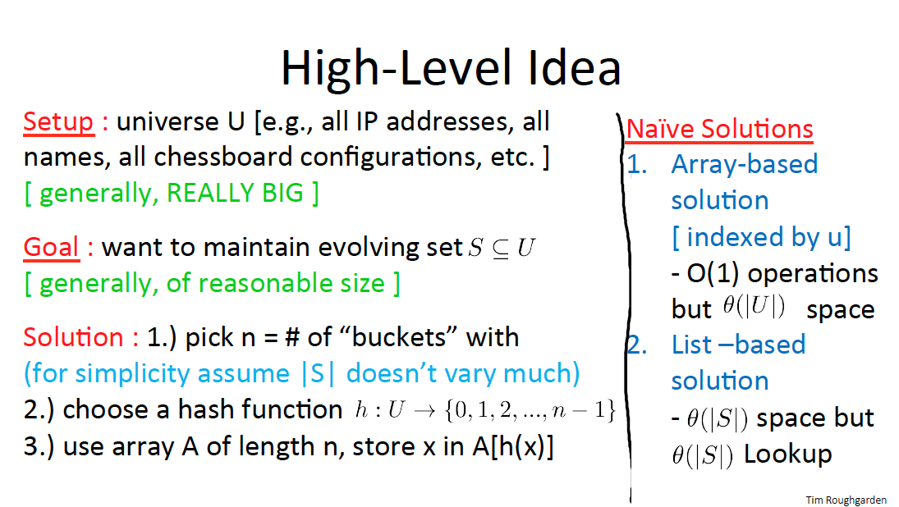
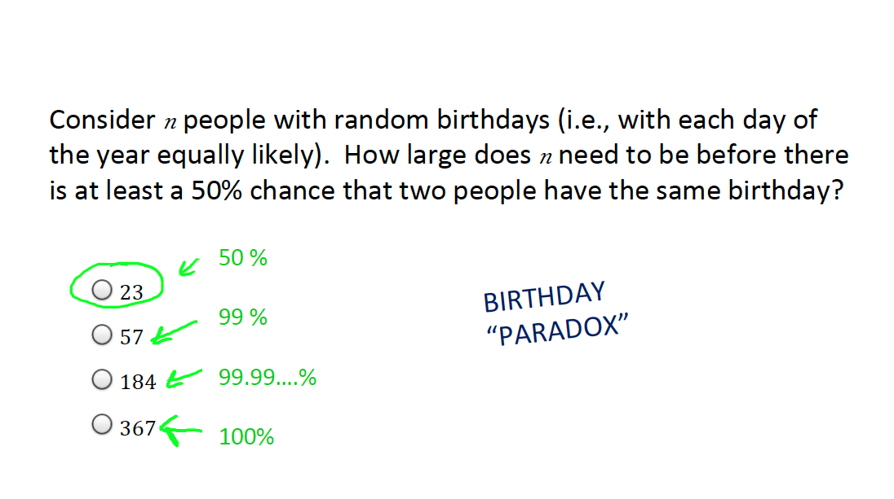
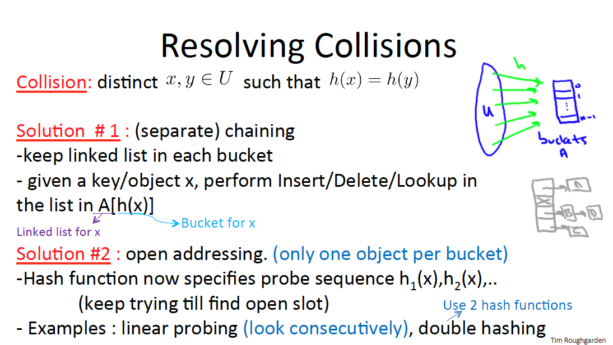
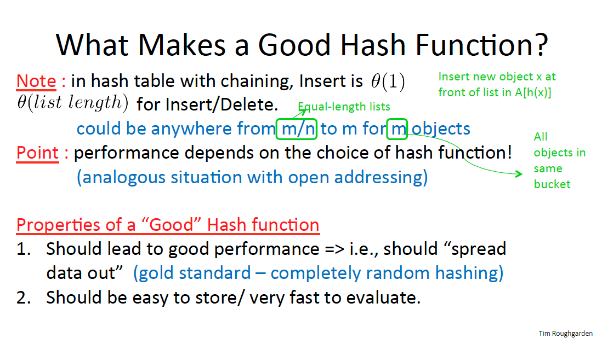
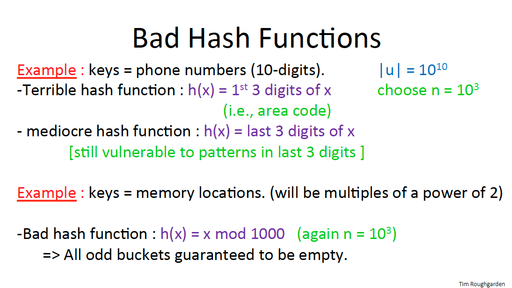
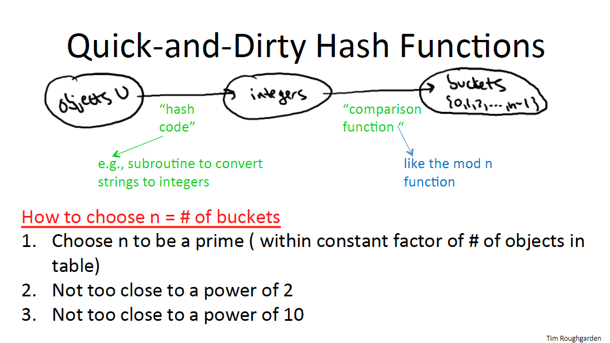

# Two Sum
[https://en.wikipedia.org/wiki/Hash_table](https://en.wikipedia.org/wiki/Hash_table)

## Contents
* [Lecture Slides](#lecture-slides)
* [Solution](#solution)
* [Build Instructions](#build-instructions)
* [Dependencies](#dependencies)

## Lecture Slides

---

---

---

---

---

---

---

---

---

---

---

---

---

## Solution
```cpp

    /**
     *
     * Modern C++ implementation of Two Sum algorithm
     *
     * (c) Copyright 2019 Clayton J. Wong ( http://www.claytonjwong.com )
     *
     **/
    
    
    #include <iostream>
    #include <sstream>
    #include <fstream>
    #include <set>
    #include <unordered_set>
    #include <unordered_map>
    #include <vector>
    #include <chrono>
    
    
    using namespace std;
    using namespace std::chrono;
    
    
    template< typename Type >
    class FastSolution
    {
    public:
    
        using Unique = unordered_set< Type >;
        using Buckets = unordered_map< Type, Unique >;
        using Targets = unordered_set< Type >;
    
        size_t count2SumRange( const string& filename, Type lo, Type hi, Type num=0, Buckets B={}, Targets T={} )
        {
            Type N{ hi - lo };
            for( fstream stream{ filename }; stream >> num; B[ num / N ].insert( num ) );
            for( auto& pair: B ) for( auto x: pair.second )
                {
                    auto pre = B.find( ( lo - x ) / N - 1 );
                    auto cur = B.find( ( lo - x ) / N     );
                    auto nxt = B.find( ( lo - x ) / N + 1 );
                    if( pre != B.end() ) for( auto y: pre->second ) if( lo <= x+y && x+y <= hi ) T.insert( x+y );
                    if( cur != B.end() ) for( auto y: cur->second ) if( lo <= x+y && x+y <= hi ) T.insert( x+y );
                    if( nxt != B.end() ) for( auto y: nxt->second ) if( lo <= x+y && x+y <= hi ) T.insert( x+y );
                }
            return T.size();
        }
    
    };
    
    
    template< typename Type >
    class SlowSolution
    {
    public:
    
        using Unique = unordered_set< Type >;
        using Targets = unordered_set< Type >;
    
        size_t count2SumRange( const string& filename, Type begin, Type end, Type num=0, Unique nums={}, Targets T={} )
        {
            auto N{ end - begin };
            for( fstream stream{ filename }; stream >> num; nums.insert( num ) );
            for( auto it{ nums.cbegin() }; it != nums.cend(); ++it )
            {
                auto x{ *it };
                for( Type t{ begin }; t <= end; ++t ) // (t)argets
                {
                    auto y{ t - x };
                    if( nums.find( y ) != nums.end() )
                        T.insert( t );
                }
            }
            return T.size();
        }
    
    };
    
    
    using Time = std::chrono::high_resolution_clock;
    
    int main()
    {
        using Type = long long;
    
        FastSolution< Type > fast;
        auto fastStart = Time::now();
        auto fastResult = fast.count2SumRange( "input.txt", -10000, 10000 );
        auto fastFinish = Time::now();
        cout << "fast answer ( " << fastResult << " ) found in "
             << duration_cast< seconds >( fastFinish - fastStart ).count()
             << " seconds " << endl << endl;
    
        SlowSolution< Type > slow;
        auto slowStart = Time::now();
        auto slowResult = slow.count2SumRange( "input.txt", -10000, 10000 );
        auto slowFinish = Time::now();
        cout << "slow answer ( " << slowResult << " ) found in "
             << duration_cast< seconds >( slowFinish - slowStart ).count()
             << " seconds " << endl;
    
        return 0;
    }

```

## Build Instructions
Use ```cmake``` to build this project:

```
    cmake --build cmake-build-debug --target two_sum -- -j 4
```

## Dependencies
* [cmake.org](https://cmake.org)
