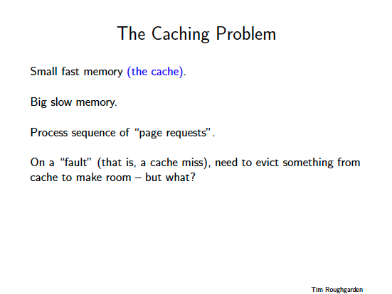
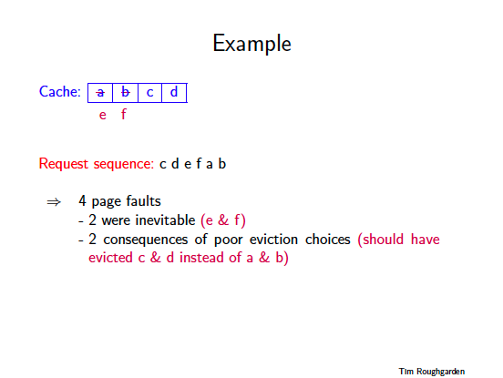
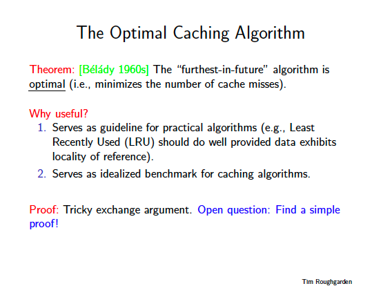

# LRU Cache
[https://en.wikipedia.org/wiki/Cache_replacement_policies#Least_recently_used_(LRU)](https://en.wikipedia.org/wiki/Cache_replacement_policies#Least_recently_used_(LRU))

## Contents
* [Lecture Slides](#lecture-slides)
* [Solution](#solution)
* [Build Instructions](#build-instructions)
* [Dependencies](#dependencies)

## Lecture Slides

---

---

---

---

## Solution
```cpp

    /**
     *
     * Modern C++ implementation of LRU cache algorithm
     *
     * (c) Copyright 2019 Clayton J. Wong ( http://www.claytonjwong.com )
     *
     **/
    
    
    /*
    
    146. LRU Cache
    
    https://leetcode.com/problems/lru-cache/description/
    Design and implement a data structure for Least Recently Used (LRU) cache. It should support the following operations: get and put.
    
    get(key) - Get the value (will always be positive) of the key if the key exists in the cache, otherwise return -1.
    put(key, value) - Set or insert the value if the key is not already present. When the cache reached its capacity, it should invalidate the least recently used item before inserting a new item.
    
    Follow up:
    Could you do both operations in O(1) time complexity?
    
    Example:
    
    LRUCache cache = new LRUCache( 2  ); // capacity
    cache.put(1, 1);
    cache.put(2, 2);
    cache.get(1);       // returns 1
    cache.put(3, 3);    // evicts key 2
    cache.get(2);       // returns -1 (not found)
    cache.put(4, 4);    // evicts key 1
    cache.get(1);       // returns -1 (not found)
    cache.get(3);       // returns 3
    cache.get(4);       // returns 4
    
    */
    
    
    #include <iostream>
    #include <unordered_map>
    
    
    using namespace std;
    
    
    
    class LRUCache {
        class LinkedList{
            class Node{
            public:
                int key;
                shared_ptr<Node> prev, next;
                Node(int key) : key{key}, prev{nullptr}, next{nullptr} {}
            };
            shared_ptr<Node> head_, tail_;
            int size_, cap_;
    
        public:
            LinkedList() {
                head_=make_shared<Node>(-1);
                tail_=make_shared<Node>(-1);
                head_->next=tail_;
                tail_->prev=head_;
                size_=0;
                cap_=0;
            }
    
            int Size() { return size_; }
    
            void Cap(int capacity) { cap_=capacity; }
    
            bool Full(){
                return size_>=cap_;
            }
    
            void Add(int key){
                auto node=make_shared<Node>(key);
                node->prev=head_;
                node->next=head_->next;
                head_->next->prev=node;
                head_->next=node;
                ++size_;
            }
    
            void Del(int key){
                shared_ptr<Node> itr=head_->next;
                while (itr!=tail_ && itr->key!=key){
                    itr=itr->next;
                }
                if (itr!=tail_){
                    itr->prev->next=itr->next;
                    itr->next->prev=itr->prev;
                    --size_;
                }
            }
    
            shared_ptr<Node> Pop(){
                if (Size()==0) return nullptr;
                auto res=tail_->prev;
                tail_->prev->prev->next=tail_;
                tail_->prev=tail_->prev->prev;
                return res;
            }
        };
    
        unordered_map<int,int> hash_{};
        LinkedList list_{};
    
    public:
        LRUCache(int capacity){
            list_.Cap(capacity);
        }
    
        int get(int key) {
            auto entry=hash_.find(key);
            if (entry==hash_.end()) return -1;
            int val=entry->second;
            list_.Del(key);
            list_.Add(key);
            return val;
        }
    
        void put(int key, int val) {
            auto entry=hash_.find(key);
            if (entry==hash_.end()){
                if (list_.Full()){
                    auto del=list_.Pop();
                    hash_.erase(del->key);
                }
            }
            list_.Del(key);
            list_.Add(key);
            hash_[key]=val;
        }
    };
    
    /**
     * Your LRUCache object will be instantiated and called as such:
     * LRUCache obj = new LRUCache(capacity);
     * int param_1 = obj.get(key);
     * obj.put(key,value);
     */
    
    int main(int argc, const char * argv[]) {
    
        LRUCache c(2);
    
        c.put(1,1);
        c.put(2,2);
        c.put(3,3);
        cout << c.get(2) << endl;
    
        return 0;
    }

```

## Build Instructions
Use ```cmake``` to build this project:

```
    cmake --build cmake-build-debug --target LRU_cache -- -j 4
```

## Dependencies
* [cmake.org](https://cmake.org)
