# Huffman Coding
[https://en.wikipedia.org/wiki/Huffman_coding](https://en.wikipedia.org/wiki/Huffman_coding)

## Contents
* [Lecture](#lecture)
* [Lecture Slides](#lecture-slides)
* [Solution](#solution)
* [Build Instructions](#build-instructions)
* [Dependencies](#dependencies)

# Lecture
* [Video](https://www.coursera.org/lecture/algorithms-greedy/introduction-and-motivation-plgXS)

## Lecture Slides

---
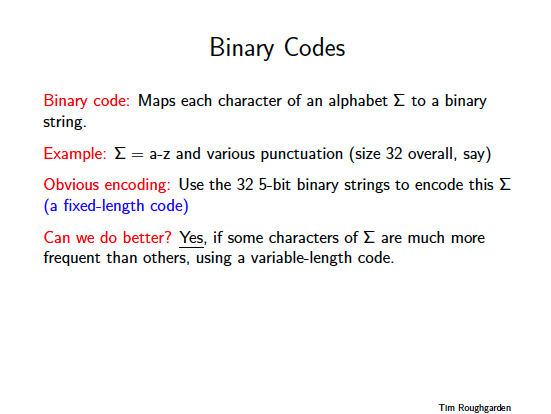
---
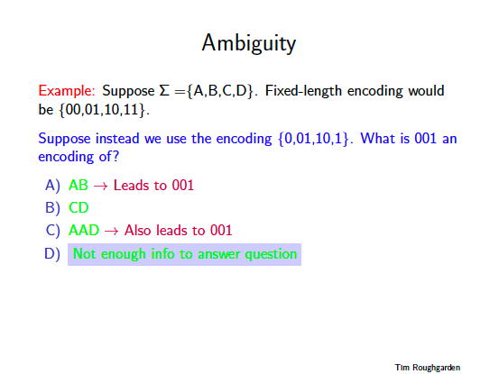
---
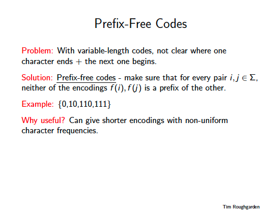
---
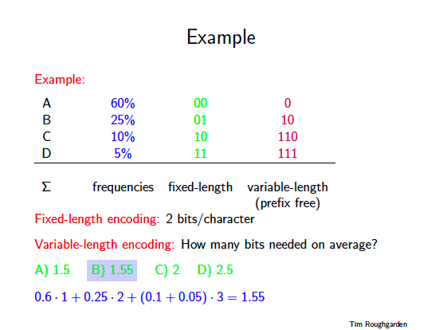
---
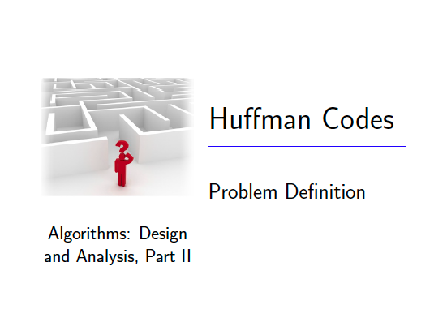
---

---

---

---

---
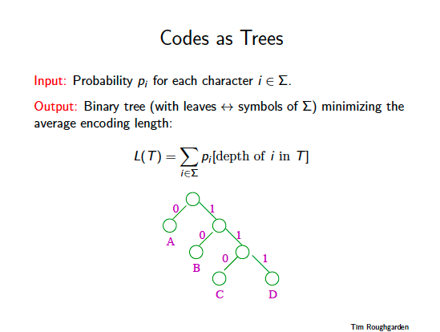
---
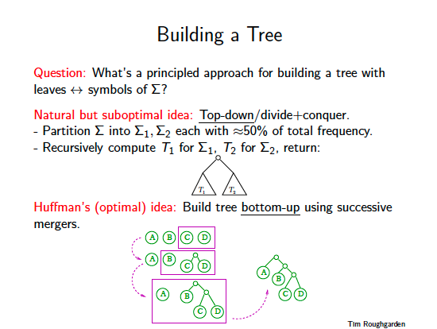
---
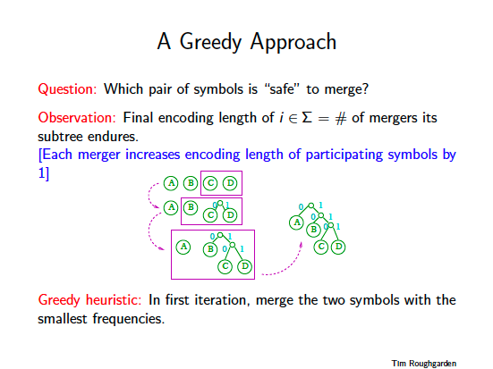
---

---
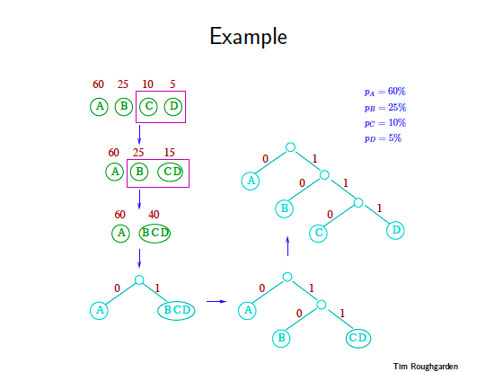
---
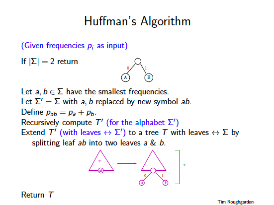
---

---

---
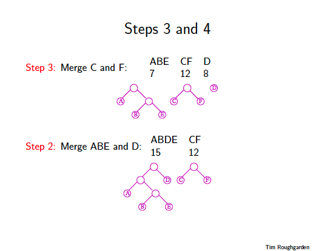
---
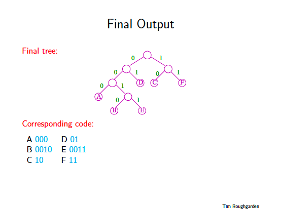
---

---
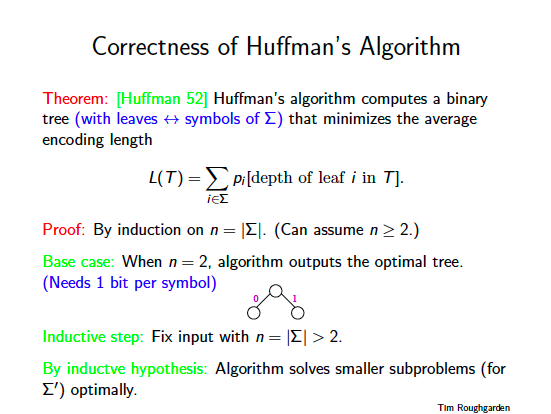
---
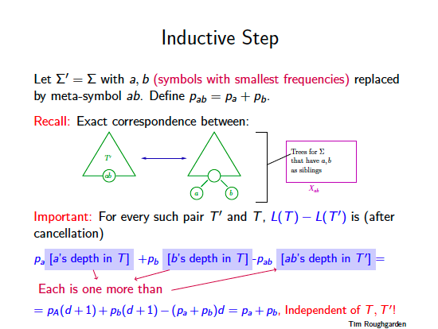
---
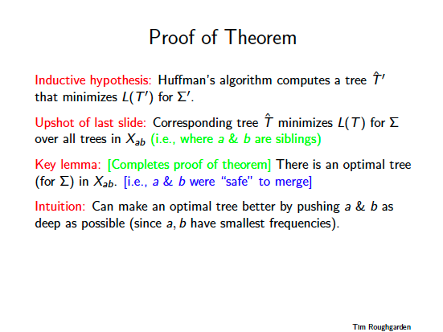
---
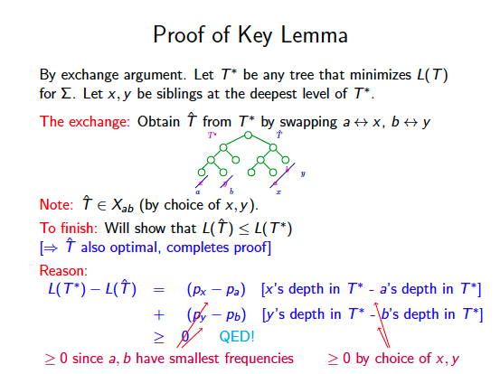
---
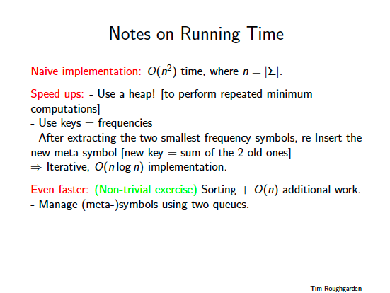
---

## Solution
```cpp

    /**
     *
     * Modern C++ implementation of Huffman's algorithm to encode weighed symbols
     *
     * (c) Copyright 2019 Clayton J. Wong ( http://www.claytonjwong.com )
     *
     **/
    
    
    #include "input.hpp"
    #include <iostream>
    #include <sstream>
    #include <vector>
    #include <queue>
    
    
    using namespace std;
    
    
    template< typename Type >
    class Solution
    {
    public:
    
        using Cost = Type;
        using MinMax = pair< Cost, Cost >;
        using Depths = vector< size_t >;
    
        MinMax minMaxCodeSize( const string& input, MinMax minMax={0,0} )
        {
            Costs costs;
            istringstream stream{ input };
            for( string line; getline( stream, line ); )
            {
                Cost cost; istringstream parser{ line }; parser >> cost;
                costs.push( make_shared< Node >( cost ) );
            }
            if( costs.empty() )
                return{ 0,0 };
            while( costs.size() > 1 )
            {
                auto first{ costs.top() }; costs.pop();
                auto second{ costs.top() }; costs.pop();
                auto next = make_shared< Node >( first->cost + second->cost, first, second );
                costs.push( next );
            }
            auto root{ costs.top() };
            Depths D;
            go( root, D );
            auto[ min, max ] = minmax_element( D.begin(), D.end() );
            return{ *min, *max };
        }
    
    private:
    
        struct Node;
        using HNode = shared_ptr< Node >;
        struct Node
        {
            Cost cost; HNode left, right;
            Node( Cost cost, HNode left={}, HNode right={} ) : cost{ cost }, left{ left }, right{ right } {}
        };
        struct Compare{ bool operator()( HNode& lhs, HNode& rhs ){ return lhs->cost > rhs->cost; } };
        using Costs = priority_queue< HNode, vector< HNode >, Compare >;
    
        void go( HNode root, Depths& D, int depth=0 )
        {
            if( ! root->left && ! root->right )
                D.push_back( depth );
            if( root->left )
                go( root->left, D, depth + 1 );
            if( root->right )
                go( root->right, D, depth + 1 );
        }
    
    };
    
    
    int main()
    {
        using Type = int;
    
        Solution< Type > s;
        auto[ min, max ] = s.minMaxCodeSize( Assignment1::Input );
        cout << "answer 1: " << max << endl << endl
             << "answer 2: " << min << endl << endl;
    
        return 0;
    }

```

## Build Instructions
Use ```cmake``` to build this project:

```
    cmake --build cmake-build-debug --target huffman -- -j 4
```

## Dependencies
* [cmake.org](https://cmake.org)
