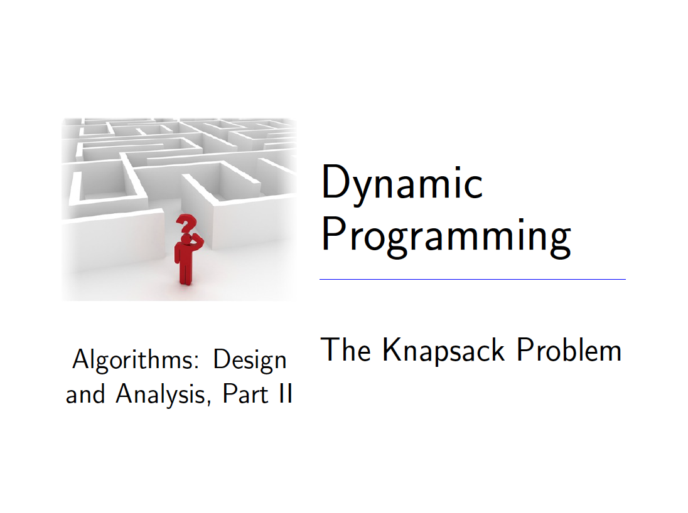
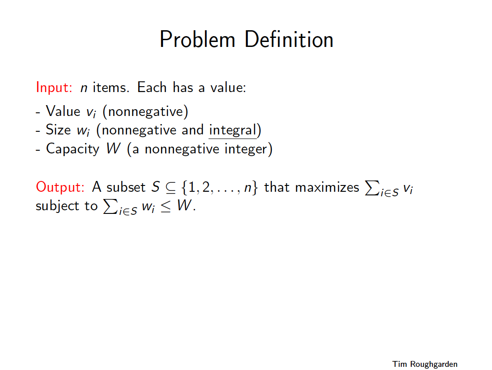
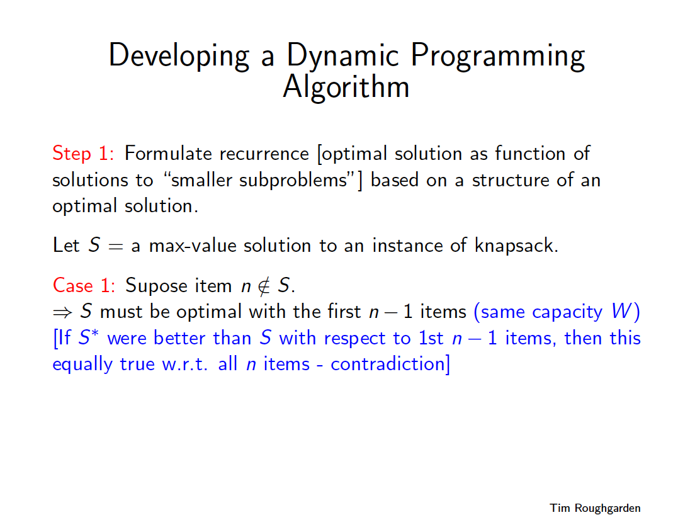
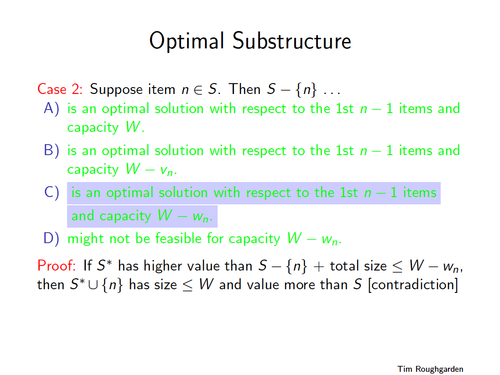
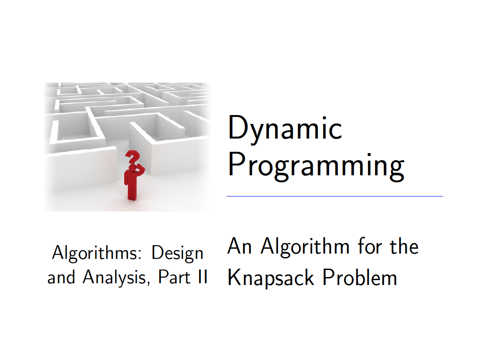
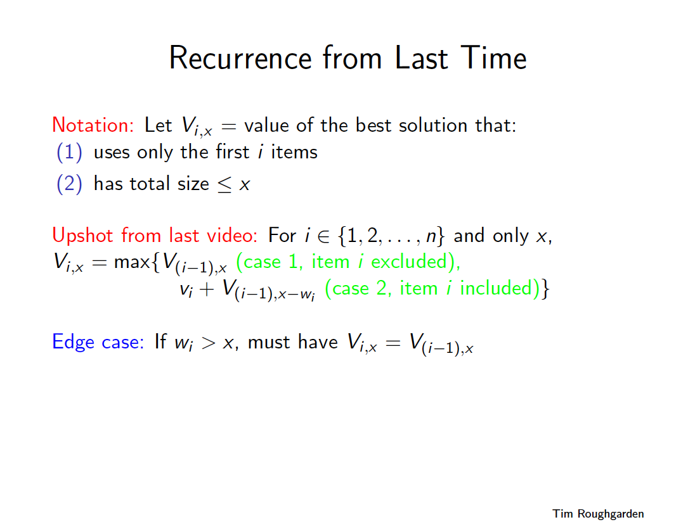
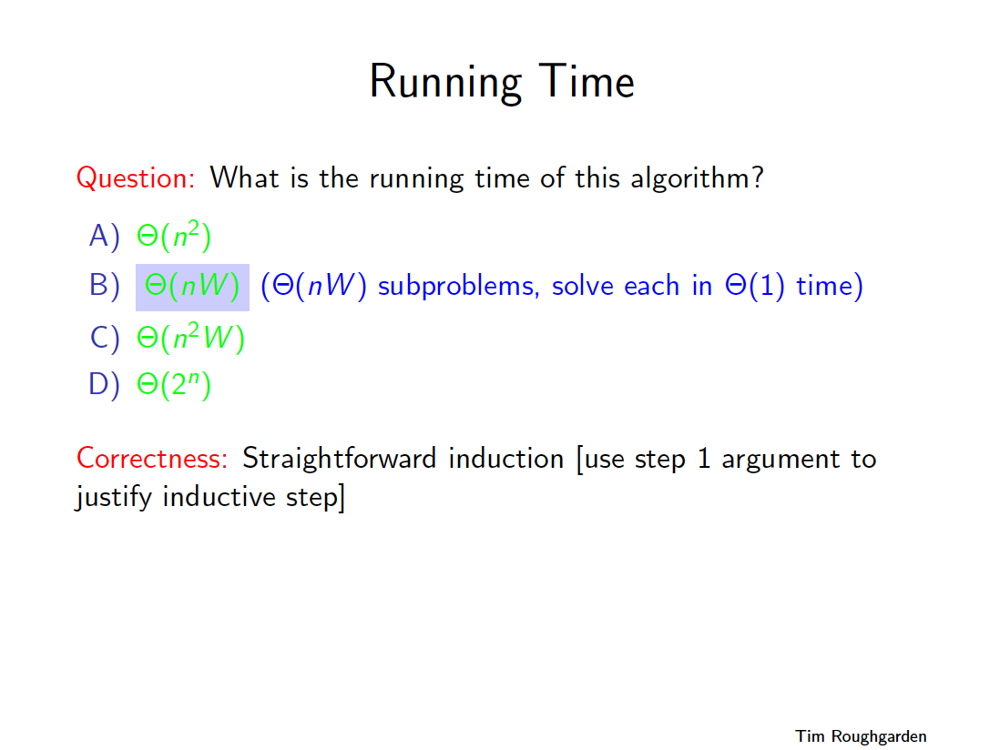
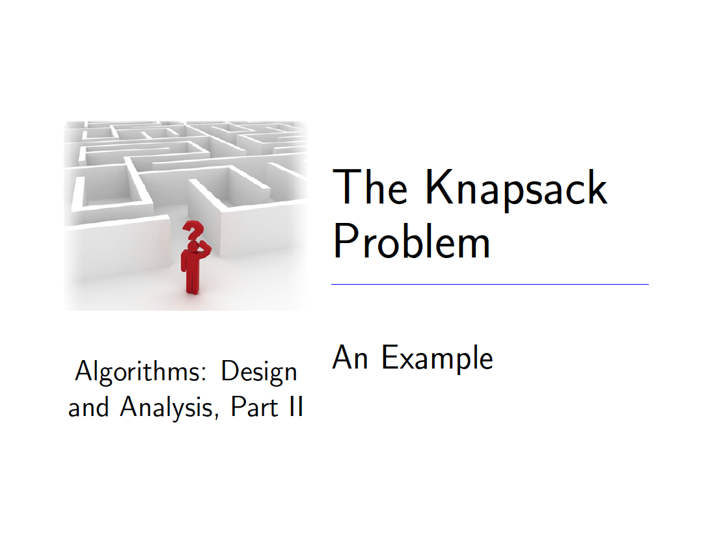
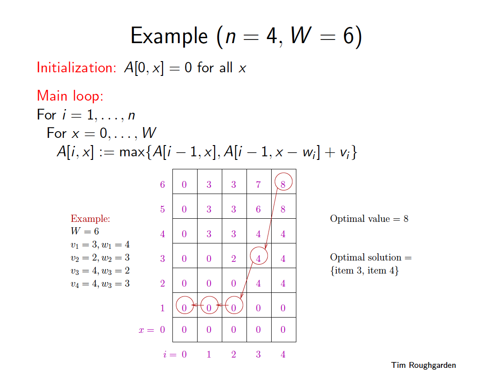

# Knapsack
[https://en.wikipedia.org/wiki/Knapsack_problem](https://en.wikipedia.org/wiki/Knapsack_problem)

## Contents
* [Lecture](#lecture)
* [Lecture Slides](#lecture-slides)
* [Solution](#solution)
* [Build Instructions](#build-instructions)
* [Dependencies](#dependencies)

# Lecture
* [Video](https://www.coursera.org/lecture/algorithms-greedy/the-knapsack-problem-LIgLJ)

## Lecture Slides

---

---

---

---

---

---

---

---

---

---

## Solution
```cpp

    /**
     *
     * Modern C++ implementation of Knapsack algorithm
     *
     * (c) Copyright 2019 Clayton J. Wong ( http://www.claytonjwong.com )
     *
     **/
    
    
    #include "input.hpp"
    #include <iostream>
    #include <sstream>
    #include <vector>
    #include <unordered_map>
    
    
    using namespace std;
    using Type = size_t;
    using Value = Type;
    using Cost = Type;
    using Item = pair< Value, Cost >;
    using Items = vector< Item >;
    
    
    namespace TopDown
    {
        class Solution
        {
        public:
    
            struct Xi // (X)-Cost available in the sack at a particular end position distance (i) from the beginning of the sack
            {
                Cost cost{ 0 };
                size_t pos{ 0 };
                bool operator==( const Xi& rhs ) const { return cost == rhs.cost && pos == rhs.pos; }
            };
            struct Hash{ size_t operator()( const Xi& pair ) const { return pair.cost * 2001 + pair.pos; }};
            using Memo = unordered_map< Xi, Value, Hash >;
    
            Value maxSack( Items& sack, Cost W )
            {
                Memo memo;
                return go( sack, W, sack.end(), memo );
            }
    
        private:
    
            using Iter = Items::iterator;
    
            Value go( Items& sack, Cost X, Iter end, Memo& memo )
            {
                size_t i = distance( sack.begin(), end );
                Xi key{ X, i };
                for( auto it{ memo.find( key ) }; it != memo.end(); )
                {
                    auto value = it->second;
                    return value;
                }
                if( i == 0 )
                    return memo[ key ] = 0;
                auto Vn = end - 1;
                auto Vi = Vn->first;
                auto Wi = Vn->second;
                auto S1 = go( sack, X, Vn, memo ),
                     S2 = ( X < Wi )? S1 : go( sack, X - Wi, Vn, memo ) + Vi;
                return memo[ key ] = max( S1, S2 );
            }
    
        }; // class Solution
    
    } // namespace TopDown
    
    
    namespace BottomUp
    {
        class Solution
        {
        public:
    
            using VT = vector< Type >;
            using VVT = vector< VT >;
    
            Value maxSack( Items& sack, Cost W )
            {
                auto N = sack.size();
                VVT dp( N+1, VT( W+1, 0 ) );
                for( auto i{ 1 }; i <= N; ++i )
                    for( auto x{ 1 }; x <= W; ++x )
                    {
                        auto Vi = sack[ i-1 ].first;
                        auto Wi = sack[ i-1 ].second;
                        if( x < Wi )
                            dp[ i ][ x ] = dp[ i-1 ][ x ];
                        else
                            dp[ i ][ x ] = max( dp[ i-1 ][ x ], dp[ i-1 ][ x-Wi ] + Vi );
                    }
                return dp[ N ][ W ];
            }
    
        }; // class Solution
    
    } // namespace BottomUp
    
    
    template< typename Solution >
    Cost maxSack( const string& input )
    {
        Solution solution;
        Items sack;
        Cost capacity{ 0 }, cost{ 0 };
        Value value{ 0 };
        istringstream stream{ input };
        for( string line; getline( stream, line ); )
        {
            istringstream parser{ line };
            if( capacity > 0 )
                parser >> value >> cost,
                sack.push_back({ value, cost });
            else
                parser >> capacity;
        }
        return solution.maxSack( sack, capacity );
    }
    
    
    int main()
    {
        cout << "Assignment #1 Top-Down Answer: " << maxSack< TopDown::Solution >( Assignment1::Input ) << endl
             << "Assignment #1 Bottom-Up Answer: " << maxSack< BottomUp::Solution >( Assignment1::Input ) << endl << endl
    
             << "Assignment #2 Top-Down Answer: " << maxSack< TopDown::Solution >( Assignment2::Input ) << endl
             << "Assignment #2 Bottom-Up Answer: " << maxSack< BottomUp::Solution >( Assignment2::Input ) << endl << endl;
    
        return 0;
    }

```

## Build Instructions
Use ```cmake``` to build this project:

```
    cmake --build cmake-build-debug --target knapsack -- -j 4
```

## Dependencies
* [cmake.org](https://cmake.org)
