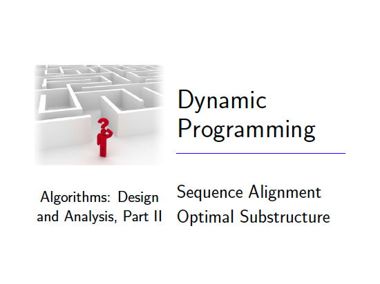
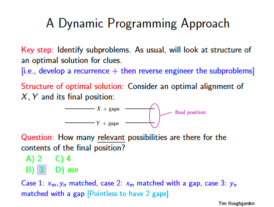
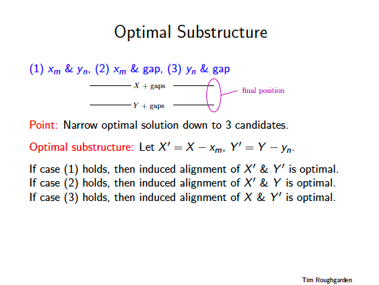
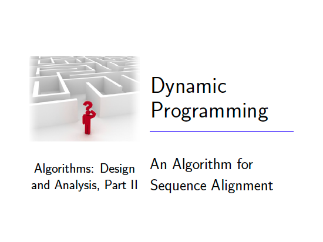
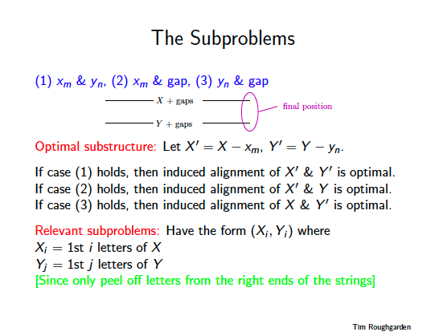
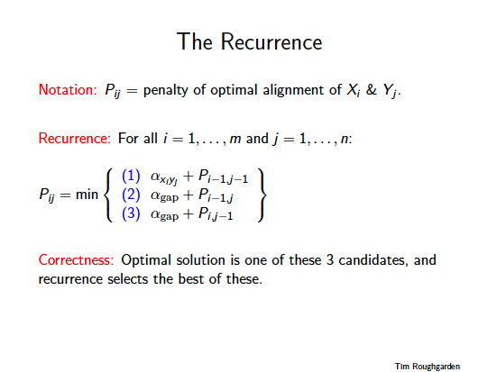
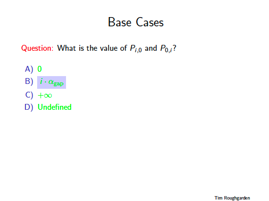
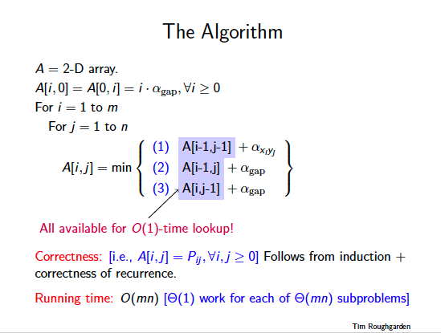
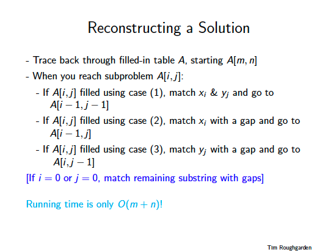

# Sequence Alignment
[https://en.m.wikipedia.org/wiki/Sequence_alignment](https://en.m.wikipedia.org/wiki/Sequence_alignment)

## Contents
* [Lecture](#lecture)
* [Lecture Slides](#lecture-slides)
* [Solution](#solution)
* [Build Instructions](#build-instructions)
* [Dependencies](#dependencies)

# Lecture
* [Video](https://www.coursera.org/lecture/algorithms-greedy/application-sequence-alignment-ekVkk)

## Lecture Slides

---

---

---

---

---

---

---

---

---

---

---

## Solution
```cpp

    /**
     *
     * Modern C++ implementation of Sequence Alignment algorithm to calculate Needleman-Wunsch score and reconstruct best match
     *
     * (c) Copyright 2019 Clayton J. Wong ( http://www.claytonjwong.com )
     *
     **/
    
    
    #include <iostream>
    #include <vector>
    #include <unordered_map>
    
    
    using namespace std;
    using Type = string;
    using SubType = char;
    SubType diff{ '*' }, gap{ '_' };
    using Integer = size_t;
    using VI = vector< Integer >;
    using VVI = vector< VI >;
    struct Cost{ Integer same{ 0 }, diff{ 1 }, gap{ 1 }; } cost;
    
    
    Type reconstruct( Type& X, Type& Y, VVI& dp )
    {
        if( X.empty() || Y.empty() )
            return {};
        Type result;
        auto M{ dp.size() },
             N{ dp[ 0 ].size() };
        auto i{ M-1 },
             j{ N-1 };
        for(; i > 0 && j > 0; )
        {
            auto Xi = X[ i-1 ],
                 Yj = Y[ j-1 ],
                 same = Xi;
            if( dp[ i ][ j ] == dp[ i-1 ][ j-1 ] + cost.same && ( Xi == Yj ) )
                result.push_back( Xi ),
                --i, --j;
            else
            if( dp[ i ][ j ] == dp[ i-1 ][ j-1 ] + cost.diff && ( Xi != Yj ) )
                result.push_back( diff ),
                --i, --j;
            else
            if( dp[ i ][ j ] == dp[ i-1 ][ j ] + cost.gap)
                result.push_back( gap ),
                --i;
            else
            if( dp[ i ][ j ] == dp[ i ][ j-1 ] + cost.gap )
                result.push_back( gap ),
                --j;
        }
        for(; i > 0; --i ) result.push_back( gap );
        for(; j > 0; --j ) result.push_back( gap );
        return { result.rbegin(), result.rend() }; // result is in reverse order, so return the reversed result for forward order
    }
    
    
    namespace TopDown
    {
        template< typename Type >
        class Solution
        {
        public:
    
            using Iter = typename Type::iterator;
            const Integer INF = numeric_limits< Integer >::max();
    
            VVI alignment( Type& X, Type& Y )
            {
                auto i{ X.end() },
                     j{ Y.end() };
                auto M = distance( X.begin(), i ),
                     N = distance( Y.begin(), j );
                VVI memo( M+1, VI( N+1, INF ));
                go( X, Y, i, j, memo );
                return memo;
            }
    
        private:
    
            Integer go( Type& X, Type& Y, Iter i, Iter j, VVI& memo )
            {
                auto M = distance( X.begin(), i ),
                     N = distance( Y.begin(), j );
                if( memo[ M ][ N ] < INF )
                    return memo[ M ][ N ];
                if( M == 0 ) return memo[ M ][ N ] = cost.gap * N;
                if( N == 0 ) return memo[ M ][ N ] = cost.gap * M;
                auto Xi{ *(i-1) },
                     Yj{ *(j-1) };
                return memo[ M ][ N ] =
                    min({ ( Xi == Yj )? go( X, Y, i-1, j-1, memo ) + cost.same
                                      : go( X, Y, i-1, j-1, memo ) + cost.diff,
                          go( X, Y, i-1, j, memo ) + cost.gap,
                          go( X, Y, i, j-1, memo ) + cost.gap });
            }
    
        };
    
    } // namespace TopDown
    
    
    namespace BottomUp
    {
        template< typename Type >
        class Solution
        {
        public:
    
            VVI alignment( Type& X, Type& Y )
            {
                auto M{ X.size() },
                     N{ Y.size() };
                VVI dp( M+1, VI( N+1 ) );
                for( auto i{ 0 }; i <= M; ++i ) dp[ i ][ 0 ] = i * cost.gap;
                for( auto j{ 0 }; j <= N; ++j ) dp[ 0 ][ j ] = j * cost.gap;
                for( auto i{ 1 }; i <= M; ++i ) for( auto j{ 1 }; j <= N; ++j ) // for each Xi,Yj where i=[1:M] and j=[1:N]
                {
                    auto Xi = X[ i-1 ],
                         Yj = Y[ j-1 ];
                    dp[ i ][ j ] =
                        min({ dp[ i-1 ][ j-1 ] + (( Xi == Yj )? cost.same : cost.diff ),
                              dp[ i-1 ][ j ] + cost.gap,
                              dp[ i ][ j-1 ] + cost.gap });
                }
                return dp;
            }
    
        };
    
    } // namespace BottomUp
    
    
    template< typename Solution >
    void test()
    {
        using TestCases = vector< Type >;
        using Answer = vector< Integer >;
    
        TestCases
            p{ "AGGGCT", "AGTGCTGAAAGTTGCGCCAGTGAC", "CACAATTTTTCCCAGAGAGA" },
            q{ "AGGCA",  "AGTGCTGAAGTTCGCCAGTTGACG", "CGAATTTTTCCCAGAGAGA"  };
        Answer ans{ 2, 4, 2 };
    
        Solution solution;
        for( auto i{ 0 }; i < 3; ++i )
        {
            auto X{ p[ i ] },
                 Y{ q[ i ] };
            auto dp = solution.alignment( X, Y );
            auto result = dp.back().back();
            cout << "X = " << X << endl
                 << "Y = " << Y << endl
                 << "Z = " << reconstruct( X, Y, dp ) << endl
                 << "minimum alignment cost: " << result << endl << endl;
            assert( result == ans[ i ] );
        }
    }
    
    
    int main()
    {
        //
        // Top-Down
        //
        {
            cout << "---------- Top-Down ----------" << endl;
            using Solution = TopDown::Solution< Type >;
            test< Solution >();
        }
        cout << endl << endl;
    
        //
        // Bottom-Up
        //
        {
            cout << "---------- Bottom-Up ----------" << endl;
            using Solution = BottomUp::Solution< Type >;
            test< Solution >();
        }
    
    //    ---------- Top-Down ----------
    //    X = AGGGCT
    //    Y = AGGCA
    //    Z = A_GGC*
    //    minimum alignment cost: 2
    //
    //    X = AGTGCTGAAAGTTGCGCCAGTGAC
    //    Y = AGTGCTGAAGTTCGCCAGTTGACG
    //    Z = AGTGCTG_AAGTT_CGCCAG_TGAC_
    //    minimum alignment cost: 4
    //
    //    X = CACAATTTTTCCCAGAGAGA
    //    Y = CGAATTTTTCCCAGAGAGA
    //    Z = C_*AATTTTTCCCAGAGAGA
    //    minimum alignment cost: 2
    //
    //
    //
    //    ---------- Bottom-Up ----------
    //    X = AGGGCT
    //    Y = AGGCA
    //    Z = A_GGC*
    //    minimum alignment cost: 2
    //
    //    X = AGTGCTGAAAGTTGCGCCAGTGAC
    //    Y = AGTGCTGAAGTTCGCCAGTTGACG
    //    Z = AGTGCTG_AAGTT_CGCCAG_TGAC_
    //    minimum alignment cost: 4
    //
    //    X = CACAATTTTTCCCAGAGAGA
    //    Y = CGAATTTTTCCCAGAGAGA
    //    Z = C_*AATTTTTCCCAGAGAGA
    //    minimum alignment cost: 2
    
        return 0;
    }

```

## Build Instructions
Use ```cmake``` to build this project:

```
    cmake --build cmake-build-debug --target sequence_alignment -- -j 4
```

## Dependencies
* [cmake.org](https://cmake.org)
