# Bellman Ford
[https://en.wikipedia.org/wiki/Bellman–Ford_algorithm](https://en.wikipedia.org/wiki/Bellman–Ford_algorithm)

## Contents
* [Lecture](#lecture)
* [Lecture Slides](#lecture-slides)
* [Solution](#solution)
* [Build Instructions](#build-instructions)
* [Dependencies](#dependencies)

# Lecture
* [Video](https://www.coursera.org/lecture/algorithms-npcomplete/single-source-shortest-paths-revisted-x0YZd)

## Lecture Slides

---
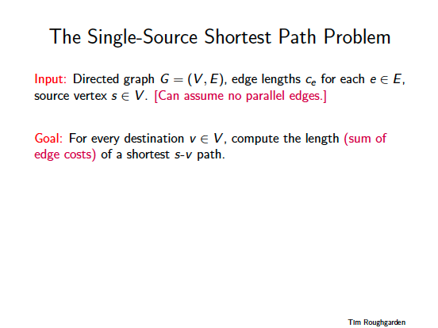
---
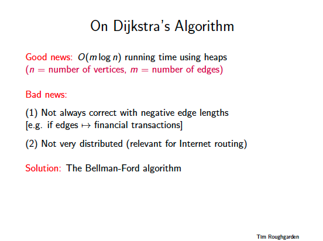
---
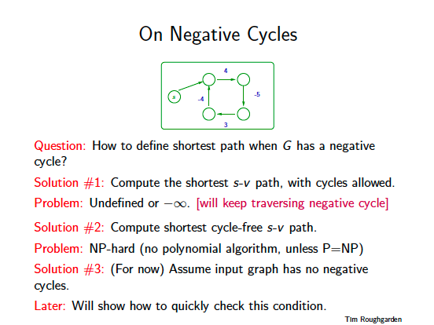
---

---

---
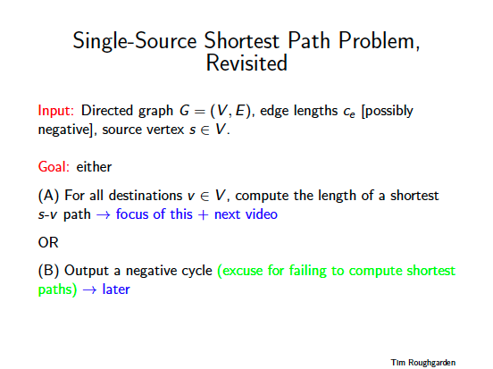
---
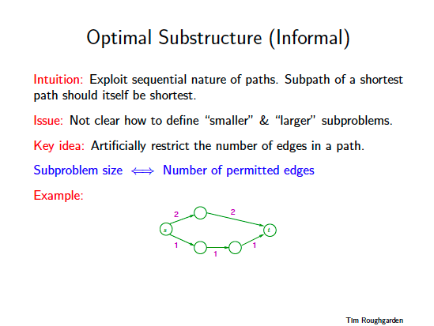
---

---

---

---
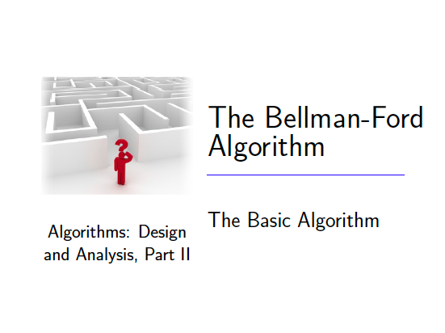
---

---

---

---

---
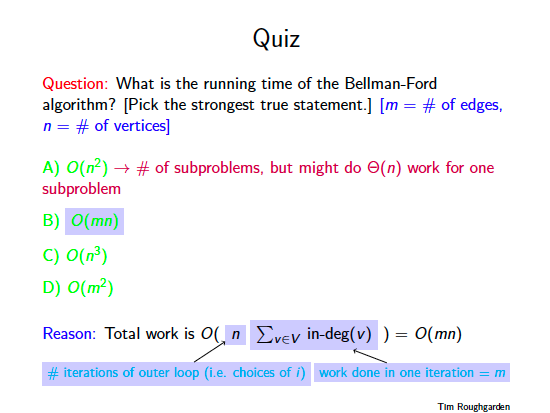
---
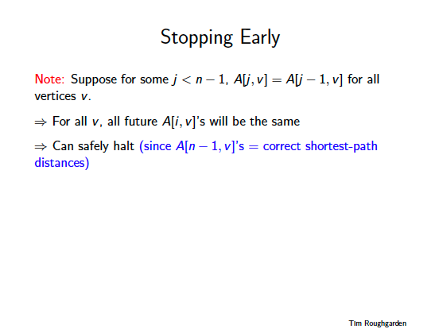
---

---

---
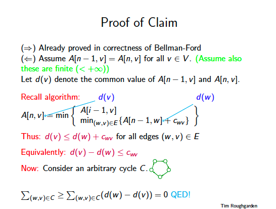
---

---
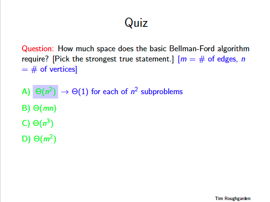
---
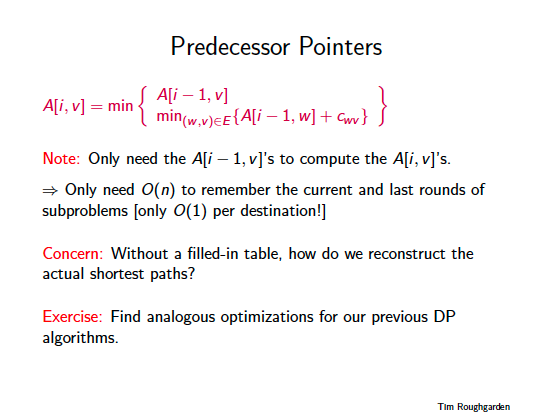
---
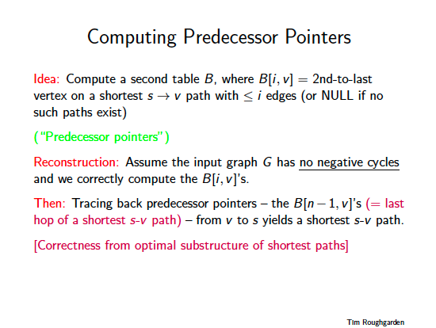
---

---

---
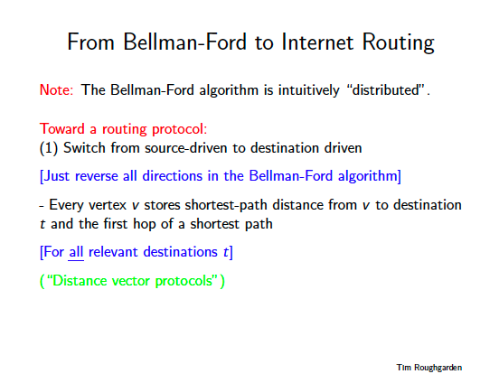
---

---

---

## Solution
```cpp

    /**
     *
     * Modern C++ implementation of Bellman-Ford algorithm to find the single-source shortest paths in a graph
     *
     * (c) Copyright 2019 Clayton J. Wong ( http://www.claytonjwong.com )
     *
     **/
    
    
    #include "input.hpp"
    #include <iostream>
    #include <sstream>
    #include <vector>
    #include <unordered_map>
    #include <unordered_set>
    
    
    #define ASSIGNMENT_INPUT 69 // comment this line to execute tests on the lecture input
    
    
    #ifndef ASSIGNMENT_INPUT
    
        //
        // Lecture Input
        //
        auto N{ 5 };
        auto Input{ Lecture::Input };
    
    #else
    
        //
        // Assignment Input
        //
        auto N{ 200 };
        auto Input{ Assignment::Input };
    
    #endif
    
    
    using namespace std;
    using Integer = long long;
    using VI = vector< Integer >;
    using VVI = vector< VI >;
    using Vertex = Integer;
    using Cost = Integer;
    static const Cost Infinity = numeric_limits< Cost >::max();
    struct Edge
    {
        Vertex u{ 0 }, v{ 0 };
        bool operator==( const Edge& rhs ) const { return u == rhs.u && v == rhs.v; }
    };
    struct Hash{ Cost operator()( const Edge& e ) const { return ( N+1 ) * e.u + e.v; } };
    using Edges = unordered_map< Edge, Cost, Hash >;
    using Vertices = unordered_set< Vertex >;
    using AdjacencyList = unordered_set< Vertex >;
    using Graph = unordered_map< Vertex, AdjacencyList >;
    
    
    Edges readInput( const string& input, Edges edges={}, Vertex u=0, Vertex v=0, char comma=',', Cost cost=0 )
    {
        istringstream stream{ input };
        for( string line; getline( stream, line ); )
        {
            stringstream parser{ line };
            parser >> u;
            while( parser >> v >> comma >> cost )
                edges.insert({ { u,v }, cost });
        }
        return edges;
    }
    
    
    Graph generateGraph( const Vertices& V, const Edges& E, Graph G={} )
    {
        for( auto& vertex: V )
            G[ vertex ] = {};
        for( auto& pair: E )
        {
            auto edge{ pair.first };
            G[ edge.u ].insert( edge.v ); // u -> v
        }
        return G;
    }
    
    
    Graph reverse( Graph& G )
    {
        Graph R{ G }; // (R)eversed (G)raph: keep G's vertex keys ( pair.first ), but clear G's adjacency lists ( pair.second )
        for_each( R.begin(), R.end(), []( auto& pair ){ pair.second={}; });
        for( auto& pair: G )
        {
            auto u{ pair.first };
            for( auto v: G[ u ] )   // u -> v
                R[ v ].insert( u ); // v -> u
        }
        return R;
    }
    
    
    namespace TopDown
    {
        class Solution
        {
        public:
    
            VVI getShortestPaths( Graph& G, Edges& E, Vertex start )
            {
                VVI memo( N+1, VI( N+1, Infinity )); // 1-based indexing
                memo[ 1 ][ start ] = 0;
                for( auto& pair: G )
                {
                    auto v{ pair.first };
                    go( G, E, memo, N, v );
                }
                return memo;
            }
    
        private:
    
            Cost go( Graph& G, Edges& E, VVI& memo, Integer i, Vertex v )
            {
                if( i == 1 || memo[ i ][ v ] < Infinity ) // 1-based indexing
                    return memo[ i ][ v ];
                Cost pre = go( G, E, memo, i-1, v ),
                     alt = Infinity;
                for( auto w: G[ v ] ) // w -> v
                {
                    Edge wv{ w,v };
                    Cost Cw = go( G, E, memo, i-1, w ),
                         Cwv = E[ wv ];
                    alt = min( alt, ( Cw < Infinity )? + Cw + Cwv : Infinity );
                }
                return memo[ i ][ v ] = min( pre, alt ); // (pre)vious path or minimum (alt)erative path to v through w + cost of edge wv
            }
    
        }; // class Solution
    
    } // namespace TopDown
    
    
    namespace BottomUp
    {
        class Solution
        {
        public:
    
            VVI getShortestPaths( Graph& G, Edges& E, Vertex start )
            {
                VVI dp( N+1, VI( N+1, Infinity )); // 1-based indexing
                dp[ 1 ][ start ] = 0;
                for( auto i{ 2 }; i <= N; ++i )
                    for( auto& pair: G )
                    {
                        auto v{ pair.first };
                        dp[ i ][ v ] = dp[ i-1 ][ v ]; // (pre)vious path or minimum (alt)erative path to v through w + cost of edge wv
                        for( auto w: G[ v ] ) // w -> v
                        {
                            Edge wv{ w,v };
                            Cost Cw = dp[ i-1 ][ w ],
                                 Cwv = E[ wv ],
                                 alt = ( Cw < Infinity )? Cw + Cwv : Infinity;
                            if( dp[ i ][ v ] > alt )
                                dp[ i ][ v ] = alt;
                        }
                    }
                return dp;
            }
    
        }; // class Solution
    
    } // namespace BottomUp
    
    
    template< typename Solution >
    void getShortestPaths( Vertex start )
    {
        Solution solution;
        Vertices V;
        for( size_t vertex{ 1 }; vertex <= N; ++vertex )
            V.insert( vertex );
        auto E = readInput( Input );
        auto G = generateGraph( V, E ), // note: lookup in the "forward" (G)raph provides outgoing adjacent vertices, therefore,
             R = reverse( G );          //       create (R)everse (G)raph since this algorithm uses incoming adjacent vertices
        auto A = solution.getShortestPaths( R, E, start );
    
    #ifdef ASSIGNMENT_INPUT
    
        ostringstream stream;
        for( auto vertex: { 7,37,59,82,99,115,133,165,188,197 } )
            stream << A[ N ][ vertex ] << ",";
        auto answer = stream.str(); answer.pop_back(); // remove trailing comma
        cout << answer << endl;
    
    #else
    
        copy( A.back().begin() + 1, A.back().end(), ostream_iterator< Cost >( cout, "," )); // +1 for 1-based indexing
        cout << endl;
    
    #endif
    }
    
    
    int main()
    {
        Vertex start{ 1 };
    
        //
        // Top-Down
        //
        {
            cout << "Top-Down answer:  ";
            getShortestPaths< TopDown::Solution >( start );
        }
    
        //
        // Bottom-Up
        //
        {
            cout << "Bottom-Up answer: ";
            getShortestPaths< BottomUp::Solution >( start );
        }
    
        return 0;
    }
    
```

## Build Instructions
Use ```cmake``` to build this project:

```
    cmake --build cmake-build-debug --target bellman_ford -- -j 4
```

## Dependencies
* [cmake.org](https://cmake.org)
