# Bellman Ford ( memory optimized + cycle detection )
[https://en.wikipedia.org/wiki/Bellman–Ford_algorithm](https://en.wikipedia.org/wiki/Bellman–Ford_algorithm)

## Contents
* [Lecture](#lecture)
* [Lecture Slides](#lecture-slides)
* [Solution](#solution)

# Lecture
* [Video](https://www.coursera.org/lecture/algorithms-npcomplete/single-source-shortest-paths-revisted-x0YZd)

## Lecture Slides

---

---

---

---
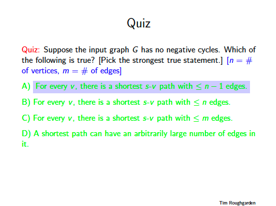
---
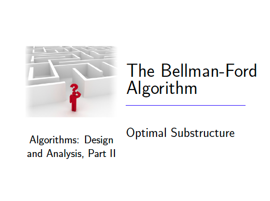
---

---

---

---
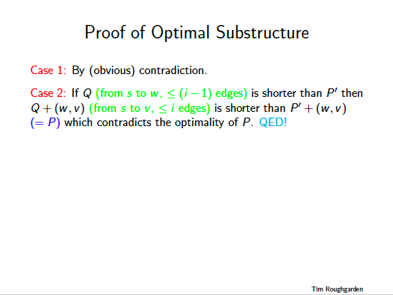
---
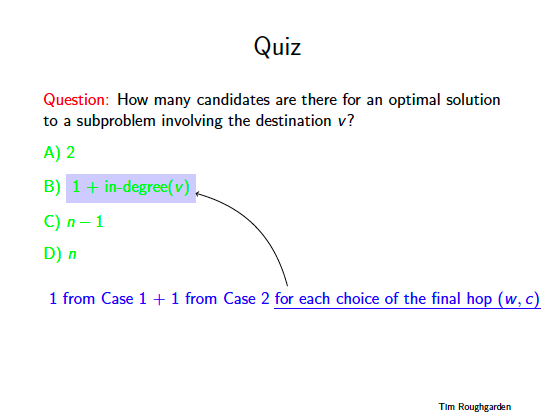
---

---

---
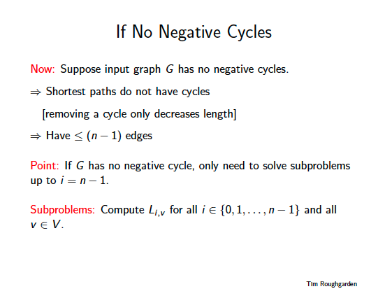
---
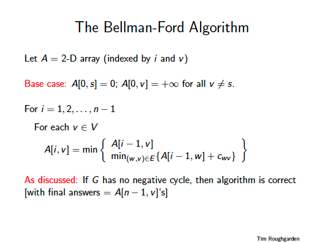
---
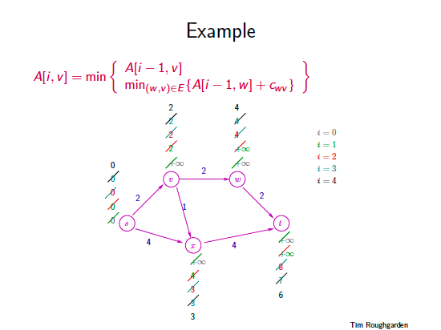
---

---

---
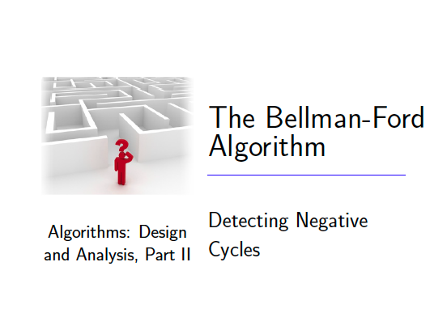
---

---

---

---

---

---

---
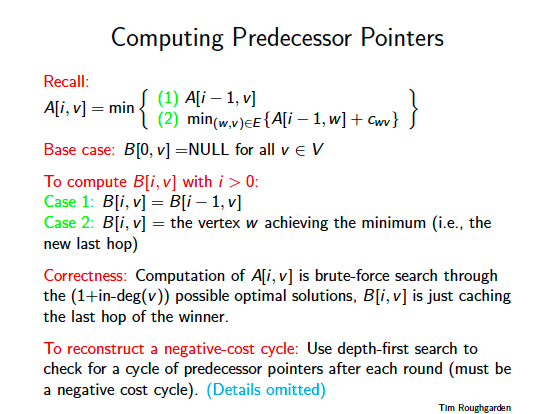
---

---

---
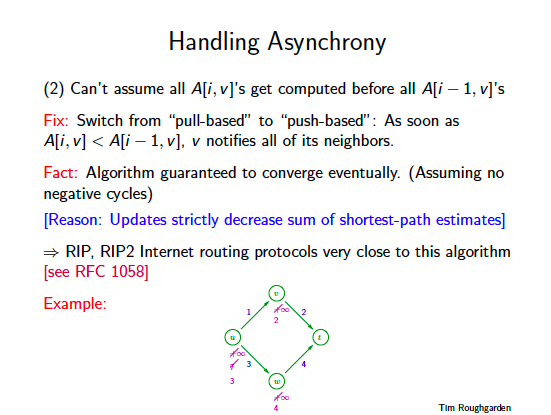
---
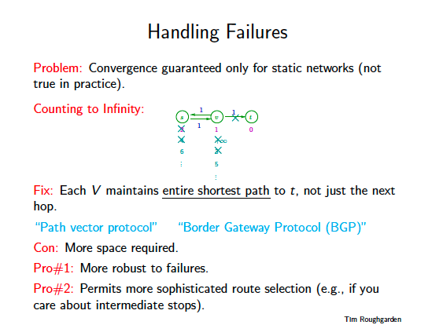
---

## Solution
**Note:** the memory optimization and cycle detection functionality are included in the implementation
of [Johnson's algorithm]( https://github.com/claytonjwong/Algorithms-Stanford/tree/master/course4/johnson ).
Refer to [Johnson's algorithm]( https://github.com/claytonjwong/Algorithms-Stanford/tree/master/course4/johnson )
for the complete solution.
```cpp

    class BellmanFord
    {
    public:
    
        using Answer = pair< VI, bool >;
    
        static Answer getShortestPaths( Graph& G, Edges& E, Vertex start )
        {
            VI pre( N+1, INF ), cur( pre );
            pre[ start ] = 0;
            for( auto i{ 1 }; i <= N; ++i, swap( pre, cur ) )
                for( auto& pair: G )
                {
                    auto v{ pair.first };
                    cur[ v ] = pre[ v ]; // (pre)vious path or minimum (alt)erative path to v through w + cost of edge wv
                    for( auto w: G[ v ] ) // w -> v
                    {
                        Edge wv{ w,v };
                        Cost Cw = pre[ w ],
                             Cwv = E[ wv ],
                             alt = ( Cw < INF )? Cw + Cwv : INF;
                        if( cur[ v ] > alt )
                            cur[ v ] = alt;
                    }
                }
            auto hasCycle = BellmanFord::hasCycle( G, E, cur );
            return{ cur, hasCycle };
        }
    
    private:
    
        static bool hasCycle( Graph& G, Edges& E, VI& P )
        {
            for( auto& e: E )
            {
                auto edge{ e.first };
                auto u{ edge.u },
                     v{ edge.v };
                auto Pu = P[ u ],      // cost of (P)ath from s -> ... -> u
                     Pv = P[ v ],      // cost of (P)ath from s -> ... -> v
                     cost{ e.second }; // cost of u -> v
                if( Pu < INF && Pv > Pu + cost )
                    return true;
            }
            return false;
        }
    
    }; // class BellmanFord
    
```
